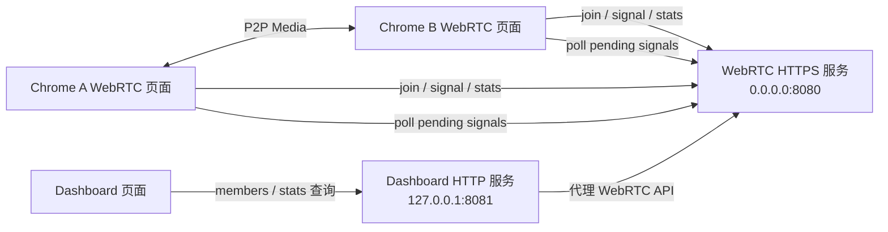
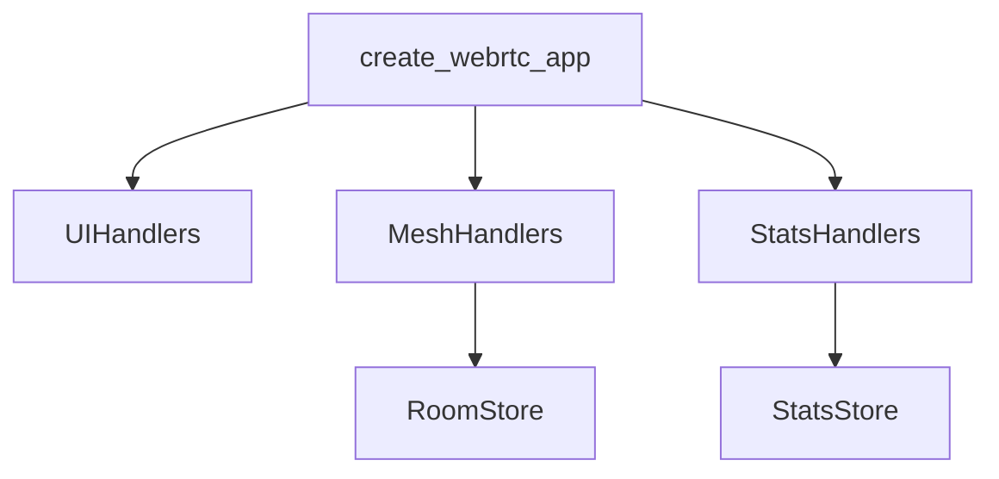
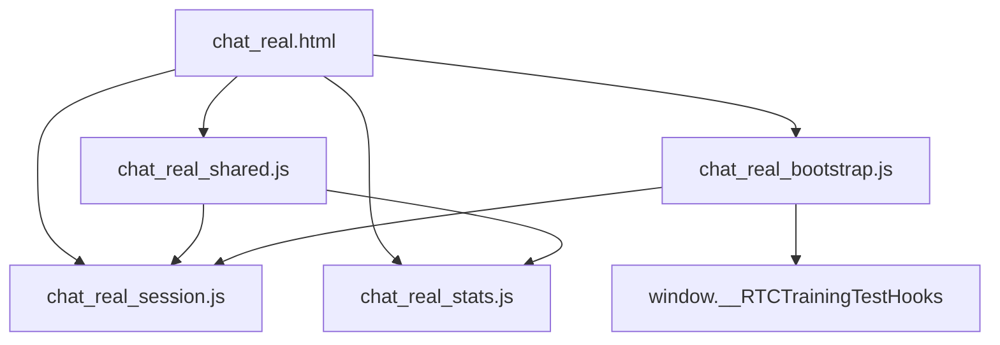
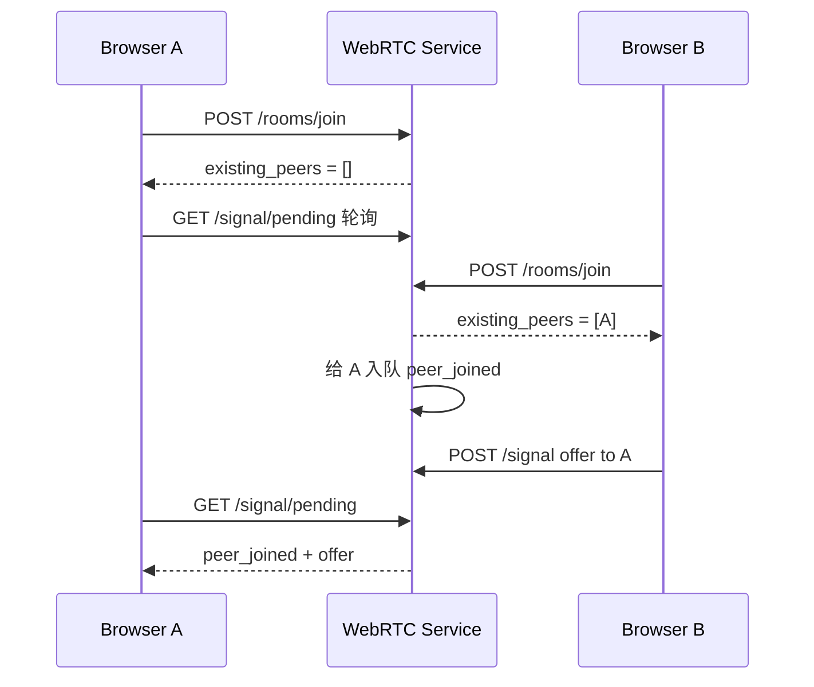
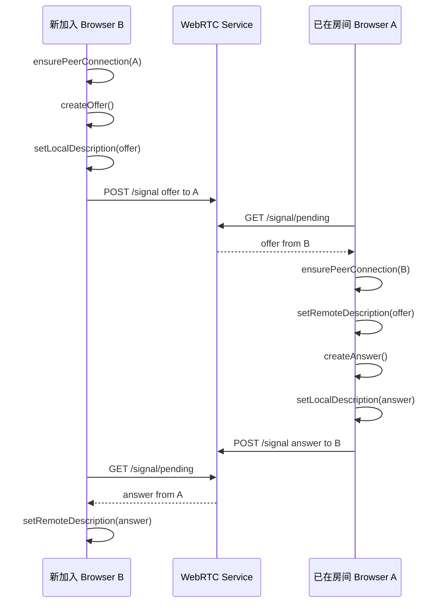
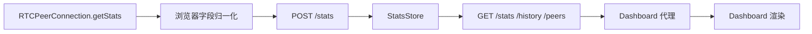
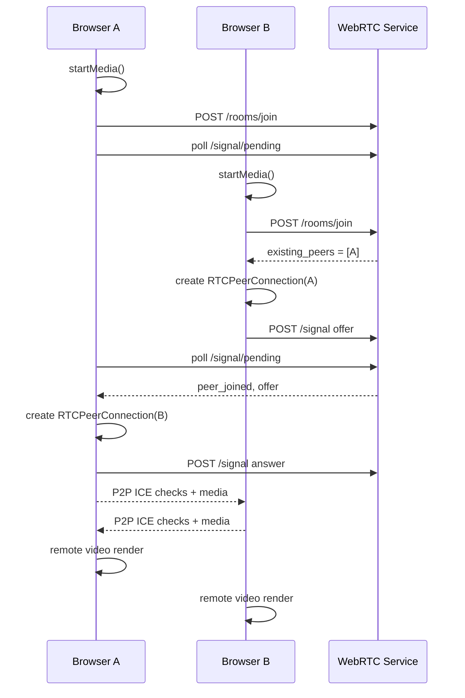
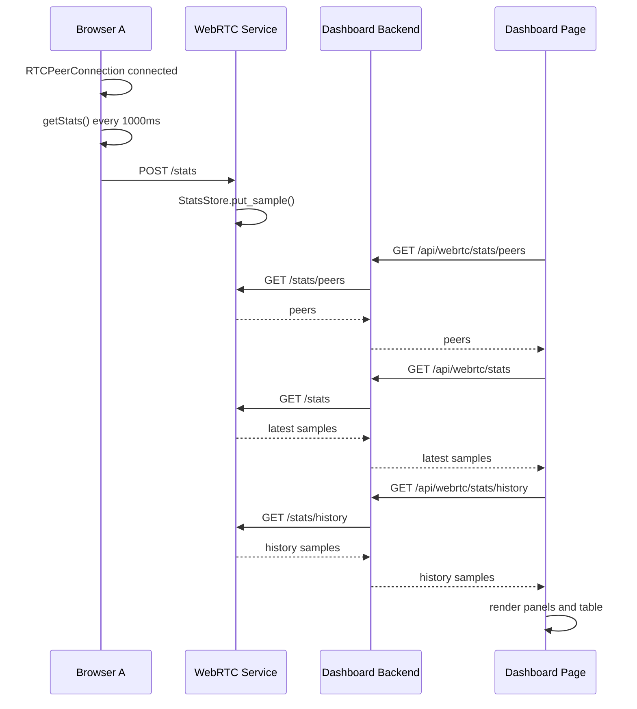

# RTCTraining 前后端设计说明

## 1. 文档范围

本文说明当前 `RTCTraining` 项目的前端、后端、Dashboard、信令、stats 采集、数据查询和页面渲染设计。

当前项目定位是本地/局域网 WebRTC 学习实验仓库，核心目标是让浏览器真实建立 P2P 音视频连接，并把连接状态和媒体质量指标展示出来，便于观察、测试和对比。

本文只描述当前源码已经实现或已经明确纳入近期计划的内容。以下能力不属于当前系统设计范围：

- 账号、鉴权、联系人、聊天记录。
- TURN、SFU、MCU。
- 公网部署和生产高可用。
- 长期数据库。
- 录制、屏幕共享、服务端混流。
- 生产级监控平台。

## 2. 总体架构

当前系统由两个本地服务和两个浏览器页面组成：



### 2.1 服务边界

| 服务 | 默认地址 | 职责 |
| --- | --- | --- |
| WebRTC 服务 | `https://localhost:8080`，监听 `0.0.0.0:8080` | 提供实验页、房间成员、HTTP 轮询信令、stats 接收与查询、CSV 导出 |
| Dashboard 服务 | `http://127.0.0.1:8081` | 提供 Dashboard 页面，代理查询 WebRTC 服务状态和 stats |

WebRTC 页面直接访问 WebRTC 服务。Dashboard 页面只访问 Dashboard 后端，由 Dashboard 后端转发到 WebRTC 服务。这样可以减少浏览器同时访问跨端口、自签名 HTTPS 和 CORS 带来的干扰。

### 2.2 代码入口

| 文件 | 职责 |
| --- | --- |
| `src/webrtc/chat_server.py` | WebRTC 服务 CLI 入口，加载 TLS 证书，启动 aiohttp app |
| `src/webrtc/app.py` | 注册 WebRTC 页面、静态资源、房间、信令、stats API |
| `src/dashboard/server.py` | Dashboard 服务 CLI 入口、Dashboard 页面和代理 API |
| `templates/webrtc/chat_real.html` | WebRTC 实验页 HTML |
| `templates/dashboard/index.html` | Dashboard 页面 HTML |
| `static/webrtc/*.js` | WebRTC 页面状态、信令、媒体、stats 采集 |
| `static/dashboard/dashboard.js` | Dashboard 数据查询和渲染 |

## 3. 后端架构

后端使用 Python `aiohttp`。当前后端没有数据库，房间、信令队列和 stats 都保存在进程内存中。



### 3.1 WebRTC 服务路由

| Method | Path | 说明 |
| --- | --- | --- |
| `GET` | `/` | 返回 WebRTC 实验页 |
| `GET` | `/static/webrtc/*` | WebRTC 静态资源 |
| `POST` | `/rooms/join` | 加入房间 |
| `POST` | `/rooms/leave` | 离开房间 |
| `GET` | `/rooms/{roomId}/members` | 查询单个房间成员 |
| `GET` | `/rooms/members` | 查询全部房间快照 |
| `POST` | `/signal` | 发送 offer、answer、candidate 等信令 |
| `GET` | `/signal/pending` | 拉取当前 peer 待处理信令 |
| `POST` | `/stats` | 上传一条 stats 样本 |
| `GET` | `/stats` | 查询 latest stats |
| `GET` | `/stats/history` | 查询历史 stats |
| `GET` | `/stats/peers` | 查询已观察到的 peer pair |
| `GET` | `/stats/export.csv` | 导出 room 维度 CSV |
| `POST` | `/clear_stats` | 清理指定 room 的 stats |

### 3.2 Dashboard 服务路由

| Method | Path | 说明 |
| --- | --- | --- |
| `GET` | `/` | 返回 Dashboard 页面 |
| `GET` | `/static/dashboard/*` | Dashboard 静态资源 |
| `GET` | `/api/webrtc/members` | 代理 WebRTC `/rooms/members` |
| `GET` | `/api/webrtc/stats` | 代理 WebRTC `/stats` |
| `GET` | `/api/webrtc/stats/history` | 代理 WebRTC `/stats/history` |
| `GET` | `/api/webrtc/stats/peers` | 代理 WebRTC `/stats/peers` |

Dashboard 代理接口支持 `origin` 参数：

```text
/api/webrtc/stats?origin=https%3A%2F%2Flocalhost%3A8080&room_id=room1
```

后端会校验 `origin` 必须是 `http` 或 `https` URL。代理请求使用 3 秒超时，并关闭 TLS 校验以适配本地自签名证书。

### 3.3 响应格式

所有 JSON API 使用统一结构。

成功：

```json
{
  "ok": true,
  "data": {}
}
```

失败：

```json
{
  "ok": false,
  "error": {
    "code": "bad_request",
    "message": "room_id is required",
    "details": {
      "field": "room_id"
    }
  }
}
```

## 4. 关键后端对象

### 4.1 `RoomStore`

位置：`src/webrtc/room_store.py`

`RoomStore` 是纯 Python 内存对象，不依赖 aiohttp。它负责房间成员和信令消息队列。

核心字段：

```python
{
    room_id: {
        "members": {
            peer_id: {
                "client_id": peer_id,
                "display_name": display_name,
                "joined_at": timestamp,
                "last_seen": timestamp,
                "active": True
            }
        },
        "pending_messages": {
            peer_id: [message, ...]
        },
        "last_activity": timestamp,
        "max_members": 3
    }
}
```

核心方法：

| 方法 | 说明 |
| --- | --- |
| `join_room(room_id, client_id, display_name)` | 加入房间，返回已有 peer；向其他成员发送 `peer_joined` |
| `leave_room(room_id, client_id)` | 离开房间；向其他成员发送 `peer_left` |
| `list_members(room_id)` | 返回指定房间成员 |
| `snapshot()` | 返回所有房间成员和待处理消息数量 |
| `send_signal(...)` | 校验发送者和接收者，写入接收者 pending queue |
| `pop_pending(room_id, client_id)` | 取出并清空当前 peer 的 pending queue |

房间默认最多 3 人，为后续 Mesh 学习场景预留。

### 4.2 `MeshHandlers`

位置：`src/webrtc/mesh_handlers.py`

`MeshHandlers` 是 HTTP 层适配器。它只做这些事情：

- 读取 JSON body 或 query。
- 校验必填字段。
- 调用 `RoomStore`。
- 把异常映射为 HTTP 状态码和统一 JSON 响应。

错误映射：

| 异常 | HTTP 状态 | code |
| --- | --- | --- |
| 缺少字段 | `400` | `bad_request` |
| 非法信令类型 | `400` | `bad_request` |
| 房间满员 | `409` | `room_full` |
| peer 不存在 | `404` | `not_found` |

### 4.3 `StatsStore`

位置：`src/webrtc/stats_store.py`

`StatsStore` 是纯 Python 内存对象，负责保存浏览器上传的 stats 样本。

样本分区 key：

```text
(room_id, peer_id, remote_peer_id, test_session_id)
```

隔离维度：

| 字段 | 说明 |
| --- | --- |
| `room_id` | 房间 |
| `peer_id` | 上传样本的本端 peer |
| `remote_peer_id` | 当前样本对应的远端 peer |
| `test_session_id` | 实验会话，可为空 |

内部维护两份索引：

| 字段 | 类型 | 说明 |
| --- | --- | --- |
| `_latest` | dict | 每个 peer pair 的最新样本 |
| `_history` | dict + deque | 每个 peer pair 的历史样本，默认最多 300 条 |

写入时会补充：

- `timestamp`：请求未传时使用服务端当前时间。
- `sample_index`：服务进程内单调递增序号。
- `test_session_id`：未传时保留为 `None`。
- `metrics`：复制为普通 dict，避免外部引用影响存储内容。

### 4.4 `StatsHandlers`

位置：`src/webrtc/stats_handlers.py`

`StatsHandlers` 负责 stats API 的参数校验、查询过滤和 CSV 输出。

`POST /stats` 必填字段：

```json
{
  "room_id": "room1",
  "peer_id": "peer-a",
  "remote_peer_id": "peer-b",
  "test_session_id": null,
  "metrics": {}
}
```

`metrics` 必须是对象。当前支持的常见指标：

| 字段 | 单位 | 说明 |
| --- | --- | --- |
| `connection_state` | 文本 | `RTCPeerConnection.connectionState` |
| `ice_connection_state` | 文本 | `RTCPeerConnection.iceConnectionState` |
| `rtt_ms` | ms | candidate pair RTT |
| `packets_sent` | count | 已发送包数 |
| `packets_received` | count | 已接收包数 |
| `packets_lost` | count | 丢包数 |
| `jitter_ms` | ms | RTP jitter |
| `bitrate_kbps` | kbps | 按 bytes 增量计算 |
| `fps` | frame/s | 视频帧率 |
| `frame_width` | px | 视频宽 |
| `frame_height` | px | 视频高 |
| `codec` | 文本 | codec MIME type |
| `bytes_sent` | bytes | 已发送字节数 |
| `bytes_received` | bytes | 已接收字节数 |
| `nack_count` | count | NACK 数 |
| `pli_count` | count | PLI 数 |
| `fir_count` | count | FIR 数 |

CSV 导出字段：

```text
sample_index,timestamp,room_id,test_session_id,peer_id,remote_peer_id,
rtt_ms,packets_lost,jitter_ms,bitrate_kbps,fps,frame_width,frame_height,codec
```

## 5. 前端架构

前端使用原生 HTML、CSS 和 JavaScript。当前没有构建链和前端框架。



### 5.1 页面结构

WebRTC 页面主要区域：

| DOM | 说明 |
| --- | --- |
| `connectionState` | 当前连接状态文本 |
| `roomIdInput` | 房间输入 |
| `displayNameInput` | 昵称输入 |
| `startMediaButton` | 启动本地媒体 |
| `joinRoomButton` | 加入房间 |
| `leaveRoomButton` | 离开房间 |
| `localVideo` | 本地预览 |
| `remoteVideos` | 远端视频容器 |
| `timeline` | 建联和错误事件时间线 |

### 5.2 全局状态对象

位置：`static/webrtc/chat_real_shared.js`

```javascript
const state = {
  clientId: `peer-${crypto.randomUUID()}`,
  roomId: "room1",
  connectionState: "idle",
  peers: {},
  peerConnections: {},
  remoteStreams: {},
  pendingCandidates: {},
  statsTimer: null,
  statsUploadInFlight: false,
  statsPrevious: {},
  statsUploadedCount: 0,
  latestStats: {},
  timeline: [],
  localStream: null,
  pollingTimer: null
};
```

关键字段说明：

| 字段 | 说明 |
| --- | --- |
| `clientId` | 当前浏览器 peer id，页面加载时生成 |
| `roomId` | 当前房间 |
| `connectionState` | 页面级连接状态 |
| `peers` | 已知远端 peer |
| `peerConnections` | `remotePeerId -> RTCPeerConnection` |
| `remoteStreams` | `remotePeerId -> MediaStream` |
| `pendingCandidates` | remote description 尚未设置时暂存 ICE candidate |
| `statsPrevious` | 计算 bitrate 所需的上一轮 bytes 和时间 |
| `latestStats` | 已上传且服务端返回的最新样本 |
| `timeline` | 页面可观察事件 |

### 5.3 页面状态

当前页面会写入这些主要状态：

| 状态 | 触发点 |
| --- | --- |
| `idle` | 页面初始状态 |
| `media_requesting` | 点击 Start Media 后请求摄像头和麦克风 |
| `media_ready` | 本地媒体获取成功 |
| `joining` | 正在加入房间 |
| `joined` | 加入房间成功 |
| `connected` | 任一 `RTCPeerConnection` 进入 connected/completed |
| `left` | 离开房间后 |
| `failed` | 媒体或 join 失败 |

事件时间线由 `addTimelineEvent(type, details)` 写入，事件包含：

```javascript
{
  event_id,
  timestamp,
  room_id,
  peer_id,
  remote_peer_id,
  category,
  type,
  direction,
  summary,
  details
}
```

### 5.4 测试钩子

页面暴露 `window.__RTCTrainingTestHooks`，供 Playwright 读取状态和驱动页面：

| 方法 | 说明 |
| --- | --- |
| `getState()` | 返回页面连接状态 |
| `getClientId()` | 返回当前 peer id |
| `getRoomId()` | 返回当前 room id |
| `getPeers()` | 返回已知 peer |
| `getTimeline()` | 返回事件时间线 |
| `getConnectedPeerCount()` | 返回 connected peer 数量 |
| `getConnectedPeerIds()` | 返回 connected remote peer ids |
| `getRemoteVideoCount()` | 返回远端 video 元素数量 |
| `getStatsUploadedCount()` | 返回 stats 上传次数 |
| `getLatestStats()` | 返回最新 stats |
| `startMedia()` | 触发本地媒体 |
| `joinRoom(roomId, displayName)` | 加入房间 |
| `leaveRoom()` | 离开房间 |

## 6. 信令机制

当前信令通过 HTTP 轮询实现。服务端只负责传递应用层消息，不参与媒体协商，也不解析 SDP。

### 6.1 信令类型

客户端可发送：

| type | 说明 |
| --- | --- |
| `offer` | 发起方创建的 SDP offer |
| `answer` | 接收方创建的 SDP answer |
| `candidate` | ICE candidate |
| `renegotiate` | 为后续重协商预留 |

服务端生成：

| type | 说明 |
| --- | --- |
| `peer_joined` | 新 peer 加入，通知已有成员 |
| `peer_left` | peer 离开，通知剩余成员 |

### 6.2 信令消息结构

```json
{
  "type": "offer",
  "from_peer_id": "peer-a",
  "to_peer_id": "peer-b",
  "payload": {}
}
```

`payload` 对服务端透明。对于 `offer` 和 `answer`，它是浏览器 `RTCSessionDescription.toJSON()` 结果。对于 `candidate`，它是 `RTCIceCandidate.toJSON()` 结果。

### 6.3 加入房间流程



当前实现中，新加入者会对 `existing_peers` 主动创建 offer。已有成员收到 `peer_joined` 后只更新本地 peer 列表，不主动创建 offer。

### 6.4 Offer / Answer 流程



### 6.5 ICE Candidate 流程

每个 `RTCPeerConnection` 注册 `icecandidate` 事件。浏览器产生 candidate 后立即发送：

```text
POST /signal
type = candidate
payload = event.candidate.toJSON()
```

接收方处理逻辑：

1. 找到或创建对应 `RTCPeerConnection`。
2. 如果 `remoteDescription` 已设置，立即 `addIceCandidate()`。
3. 如果 `remoteDescription` 尚未设置，先放入 `pendingCandidates[remotePeerId]`。
4. 当 offer 或 answer 设置 remote description 后，调用 `flushPendingCandidates(remotePeerId)`。

这个设计避免 candidate 早于 SDP 到达时触发浏览器异常。

### 6.6 轮询策略

浏览器每 250ms 请求：

```text
GET /signal/pending?room_id=room1&client_id=peer-a
```

服务端返回并清空该 peer 的 pending queue：

```json
{
  "ok": true,
  "data": {
    "messages": []
  }
}
```

离开房间时前端停止信令轮询，并关闭所有 peer connection。

## 7. 媒体连接机制

### 7.1 本地媒体

点击 `Start Media` 后：

```javascript
navigator.mediaDevices.getUserMedia({ audio: true, video: true })
```

成功后：

- 保存到 `shared.state.localStream`。
- 设置 `localVideo.srcObject`。
- 状态更新为 `media_ready`。
- 时间线写入 `local_media_ready`。

### 7.2 PeerConnection 创建

`ensurePeerConnection(remotePeerId)` 负责创建和复用连接：

```javascript
const peerConnection = new RTCPeerConnection({ iceServers: [] });
```

当前不配置 STUN/TURN，适合本地和局域网 host candidate 实验。

创建后会：

- 保存到 `peerConnections[remotePeerId]`。
- 初始化 `pendingCandidates[remotePeerId]`。
- 把本地 stream tracks 加入 peer connection。
- 监听 `icecandidate`，发送 candidate。
- 监听 `track`，渲染远端视频。
- 监听 connection state 和 ICE state。

### 7.3 远端视频渲染

收到 `track` 事件后调用 `ensureRemoteVideo(remotePeerId, stream)`：

1. 保存 `remoteStreams[remotePeerId] = stream`。
2. 在 `#remoteVideos` 下查找 `remoteVideo-${remotePeerId}`。
3. 不存在则创建 `<video autoplay playsInline>`。
4. 设置 `video.srcObject = stream`。

peer 离开时会关闭连接并删除对应远端 video。

## 8. Stats 数据同步机制

Stats 数据链路：



### 8.1 采集启动条件

前端在 `updateConnectedState()` 中判断连接状态：

```javascript
["connected", "completed"].includes(peerConnection.iceConnectionState) ||
peerConnection.connectionState === "connected"
```

只要存在 connected peer，就把页面状态设置为 `connected`，并启动 `RTCTrainingStats.start()`。

### 8.2 采集周期

`chat_real_stats.js` 中配置：

```javascript
const STATS_INTERVAL_MS = 1000;
```

启动后立即采集一次，之后每秒采集一次。

为了避免上一次上传还未结束又开始新一轮上传，前端使用：

```javascript
statsUploadInFlight
```

当它为 `true` 时，本轮采集直接返回。

### 8.3 字段归一化

每个 remote peer 单独调用：

```javascript
peerConnection.getStats()
```

然后遍历 report：

| report type | 使用字段 |
| --- | --- |
| `candidate-pair` 且 `state === "succeeded"` | `currentRoundTripTime -> rtt_ms` |
| `codec` | `mimeType -> codec` |
| `outbound-rtp` | packets、bytes、frame、fps、nack、pli、fir |
| `inbound-rtp` | packets、bytes、loss、jitter、frame、fps、nack、pli、fir |

bitrate 计算：

```text
bitrate_kbps =
  (本轮 bytes_sent + bytes_received - 上轮 bytes_total) * 8
  / 间隔秒数
  / 1000
```

首个样本没有上轮数据，`bitrate_kbps` 为 `null`。

### 8.4 上传样本结构

```json
{
  "room_id": "room1",
  "peer_id": "peer-a",
  "remote_peer_id": "peer-b",
  "test_session_id": null,
  "metrics": {
    "connection_state": "connected",
    "ice_connection_state": "connected",
    "rtt_ms": 12.5,
    "packets_sent": 100,
    "packets_received": 98,
    "packets_lost": 0,
    "jitter_ms": 3.2,
    "bitrate_kbps": 850.4,
    "fps": 30,
    "frame_width": 640,
    "frame_height": 480,
    "codec": "video/VP8",
    "bytes_sent": 120000,
    "bytes_received": 118000,
    "nack_count": 0,
    "pli_count": 0,
    "fir_count": 0
  }
}
```

服务端返回的 `sample` 会写入：

```javascript
shared.state.latestStats[sample.remote_peer_id] = payload.data.sample;
shared.state.statsUploadedCount += 1;
```

### 8.5 查询过滤

`GET /stats` 和 `GET /stats/history` 支持：

| query | 是否必填 | 说明 |
| --- | --- | --- |
| `room_id` | 是 | 房间 |
| `peer_id` | 否 | 本端 peer |
| `remote_peer_id` | 否 | 远端 peer |
| `test_session_id` | 否 | 实验会话 |

`GET /stats/peers` 只需要 `room_id`。

`POST /clear_stats` 只清理指定 `room_id` 的 stats，不影响其他房间。

## 9. Dashboard 数据同步与渲染

Dashboard 页面由 `templates/dashboard/index.html` 和 `static/dashboard/dashboard.js` 组成。

### 9.1 页面结构

| DOM | 说明 |
| --- | --- |
| `serviceState` | WebRTC 服务状态 |
| `checkServiceButton` | 手动检查服务按钮 |
| `webrtcOriginInput` | WebRTC 服务 origin |
| `roomSummary` | 当前 WebRTC 服务房间数量 |
| `statsRoomInput` | 要观察的 room id |
| `statsState` | stats 查询状态 |
| `peerPairList` | 已观察到的 peer pair |
| `latestStatsPanel` | 最新 stats |
| `statsHistoryTable` | 最近历史样本 |
| `csvState` | CSV 分析占位状态 |

### 9.2 启动流程

页面 DOMContentLoaded 后：

1. 读取 URL 参数 `webrtc_origin`，写入 `webrtcOriginInput`。
2. 读取 URL 参数 `room_id`，写入 `statsRoomInput`。
3. 绑定 `checkServiceButton`。
4. 暴露 `window.__RTCTrainingDashboardTestHooks`。
5. 调用 `checkService()`。
6. 调用 `loadLiveStats()`。
7. 每 1000ms 调用一次 `loadLiveStats()`。

### 9.3 服务状态查询

`checkService()` 请求：

```text
GET /api/webrtc/members?origin=<encoded_origin>
```

成功后：

- `serviceState = service_online`
- `roomSummary = N rooms`

失败后：

- `serviceState = payload.error.code`
- `roomSummary = 0 rooms`

### 9.4 Live Stats 查询

`loadLiveStats()` 请求顺序：

1. `/api/webrtc/stats/peers`
2. `/api/webrtc/stats`
3. `/api/webrtc/stats/history`

如果 peer pair 为空：

- 清空 latest stats。
- 清空 history table。
- `statsState = service_online_but_no_stats`。

如果三类请求都成功：

- 渲染 peer pair。
- 渲染 latest stats。
- 渲染最近 20 条 history。
- `statsState = stats_online`。

### 9.5 渲染策略

peer pair：

```text
peer-a -> peer-b
```

latest stats 当前取 `samples[0]` 渲染：

| Label | 指标 |
| --- | --- |
| Peer | `peer_id -> remote_peer_id` |
| RTT | `metrics.rtt_ms` |
| Loss | `metrics.packets_lost` |
| Jitter | `metrics.jitter_ms` |
| Bitrate | `metrics.bitrate_kbps` |
| FPS | `metrics.fps` |
| Resolution | `frame_width x frame_height` |
| Codec | `metrics.codec` |

history table 当前展示最近 20 条，按最新在前渲染：

| 列 | 来源 |
| --- | --- |
| Time | `sample.timestamp` |
| Peer | `sample.peer_id` |
| Remote | `sample.remote_peer_id` |
| RTT | `metrics.rtt_ms` |
| Loss | `metrics.packets_lost` |
| Jitter | `metrics.jitter_ms` |
| Bitrate | `metrics.bitrate_kbps` |
| FPS | `metrics.fps` |

空值显示为 `-`。

### 9.6 Dashboard 测试钩子

`window.__RTCTrainingDashboardTestHooks`：

| 方法 | 说明 |
| --- | --- |
| `checkService()` | 手动触发服务检查 |
| `loadLiveStats()` | 手动触发 stats 查询 |
| `getServiceState()` | 返回服务状态 |
| `getStatsState()` | 返回 stats 状态 |
| `getRoomSummary()` | 返回房间摘要 |

## 10. 端到端数据流程

### 10.1 双浏览器建联流程



### 10.2 Stats 到 Dashboard 流程



## 11. 数据隔离设计

### 11.1 房间隔离

房间成员、信令队列和 stats 查询都以 `room_id` 为第一隔离维度。

影响：

- 一个房间的信令不会投递到另一个房间。
- `/stats` 查询必须传 `room_id`。
- `/clear_stats` 只清理指定房间。
- CSV 导出只导出指定房间历史样本。

### 11.2 Peer Pair 隔离

Stats 按方向保存：

```text
peer-a -> peer-b
peer-b -> peer-a
```

这两个方向是两组样本。这样可以观察上行和下行视角差异，也适配后续 Mesh 场景。

### 11.3 Test Session 隔离

`test_session_id` 当前可以为空。字段已经进入 `StatsStore` 分区 key 和查询过滤，为后续实验会话做准备。

当前前端上传时固定为：

```javascript
test_session_id: null
```

## 12. CSV 导出设计

当前 WebRTC 服务提供：

```text
GET /stats/export.csv?room_id=room1
```

可选过滤：

```text
peer_id
remote_peer_id
test_session_id
```

响应：

- `Content-Type: text/csv`
- `Content-Disposition: attachment; filename="room1-stats.csv"`

CSV 当前用于导出服务内存中的历史样本。Dashboard 的多 CSV 对比 UI 尚未实现，`csvState` 目前是页面占位。

## 13. 错误与降级处理

### 13.1 WebRTC 页面

| 场景 | 行为 |
| --- | --- |
| 获取媒体失败 | 页面状态 `failed`，时间线写入 `media_error` |
| 加入房间失败 | 页面状态 `failed`，时间线写入 `join_room_failed` |
| 发送信令失败 | 时间线写入 `signal_error` |
| 拉取 pending 信令失败 | 时间线写入 `poll_signal_failed` |
| stats 上传失败 | 时间线写入 `stats_upload_failed` |

### 13.2 Dashboard 页面

| 场景 | 行为 |
| --- | --- |
| WebRTC 服务不可达 | Dashboard 后端返回 `service_unreachable` |
| WebRTC 上游返回 `ok=false` | Dashboard 后端返回 `upstream_error` |
| peers 为空 | 页面显示 `service_online_but_no_stats` |
| stats 查询异常 | 页面显示 `stats_error` |

## 14. 测试设计

当前测试分层：

| 测试 | 覆盖内容 |
| --- | --- |
| `tests/test_config.py` | 默认配置 |
| `tests/test_room_store.py` | 房间、成员、信令队列 |
| `tests/test_mesh_handlers.py` | join、leave、signal、pending HTTP API |
| `tests/test_stats_store.py` | stats latest/history/peers/clear |
| `tests/test_stats_handlers.py` | stats API、CSV 导出 |
| `tests/test_ui_routes.py` | WebRTC 页面、Dashboard 页面、静态资源和代理路由 |
| `tests/test_cli.py` | CLI 入口 smoke |
| `tests/test_playwright_e2e.py` | 双 Chrome P2P 建联、远端视频、stats 上传、Dashboard 代理 |

常用验证命令：

```bash
make test-unit
make test-e2e
.venv/bin/python -m pytest tests -v
```

## 15. 当前限制

| 限制 | 当前状态 |
| --- | --- |
| 浏览器 | 首版面向桌面 Chrome |
| 信令 | HTTP 轮询，每 250ms |
| 媒体网络 | 无 STUN/TURN，适合本机和局域网 |
| 存储 | 进程内存，服务重启后丢失 |
| stats history | 每个 peer pair 默认最多 300 条 |
| Dashboard latest | 当前只展示 `samples[0]` |
| Dashboard 图表 | 当前是列表和表格，尚无趋势图 |
| CSV 对比 | 导出已实现，多 CSV 对比 UI 尚未实现 |
| test session | 后端字段已预留，前端当前上传 `null` |

## 16. 后续设计方向

后续开发应保持当前边界：

- WebRTC 服务继续负责实验页、信令、stats 写入和 CSV 导出。
- Dashboard 服务继续负责页面和查询代理。
- `RoomStore`、`StatsStore` 保持纯 Python 对象，便于单元测试。
- 前端继续暴露测试钩子，状态不能只存在 DOM 文本中。
- 新能力先明确 API、状态、数据结构和测试，再进入实现。

优先级较高的下一步：

1. Dashboard stats 图表和 peer pair 选择。
2. test session 创建、结束、metadata 和 CSV 文件命名。
3. NACK、bitrate、ABR 手工实验入口。
4. 多 CSV 对比页面。
5. Mesh 拓扑和每条边的 stats 展示。

