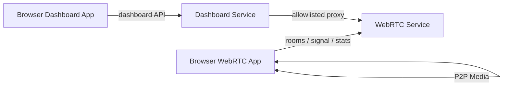

# RTCTraining Architecture

RTCTraining is a Local/LAN only WebRTC learning and experiment platform. It is designed for repeatable local RTC experiments, not public production chat.

## System Boundary

## Runtime Services

| Service | Default address | Responsibility |
| --- | --- | --- |
| WebRTC Service | `https://localhost:8080` | Experiment page, rooms, HTTP polling signaling, stats ingest/query, CSV export |
| Dashboard Service | `http://127.0.0.1:8081` | Dashboard page and allowlisted proxy calls to WebRTC Service |

The Dashboard page only calls Dashboard Service. Browser cross-port HTTPS and CORS complexity stays behind the local Dashboard backend.

## Backend Layers

- HTTP API Layer: request parsing, validation, JSON envelopes, and status codes.
- Application Service Layer: experiment workflows, dashboard snapshot aggregation, and export orchestration.
- Domain Store Layer: pure Python room, stats, and test session stores.
- Export Layer: CSV and future report artifacts.

Current code still contains some handler-to-store wiring. The open-source refactor plan moves that logic toward the layers above while preserving public behavior.

## Browser App Layer

- WebRTC browser app owns media capture, peer connections, signaling client, stats collection, and experiment controls.
- Dashboard browser app owns live snapshot rendering and CSV comparison rendering.
- Both browser apps must keep test-visible state. The WebRTC page must preserve `window.__RTCTrainingTestHooks`.

## Public Contracts

- JSON success envelope: `{"ok": true, "data": {}}`
- JSON error envelope: `{"ok": false, "error": {"code": "bad_request", "message": "room_id is required", "details": {"field": "room_id"}}}`
- Stats identity key: `room_id / peer_id / remote_peer_id / test_session_id`
- Dashboard Service is not a general-purpose HTTP proxy.

## Verification Boundary

- `make test-unit` verifies Python stores, handlers, docs contracts, and lightweight harness helpers.
- `make harness-smoke` verifies real local service startup, basic API envelopes, Dashboard proxy access, CSV header output, and process cleanup.
- `make test-e2e` verifies browser flows with Playwright.
