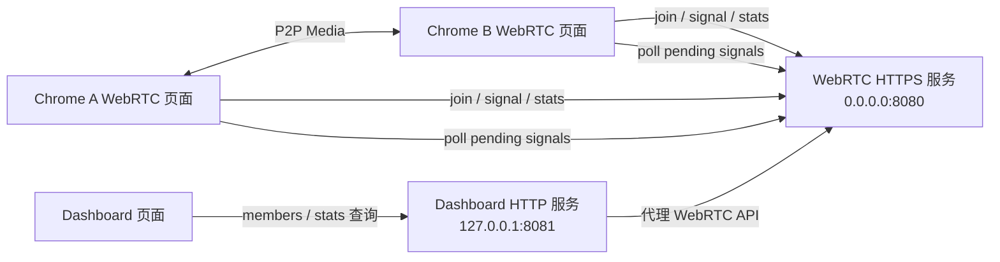
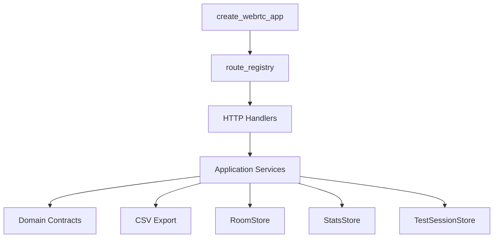
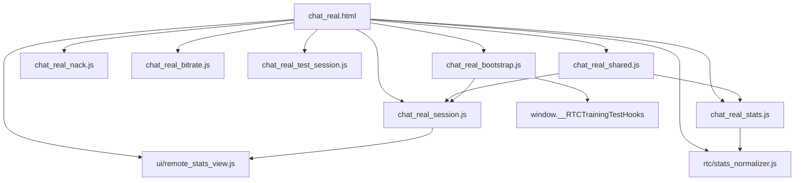
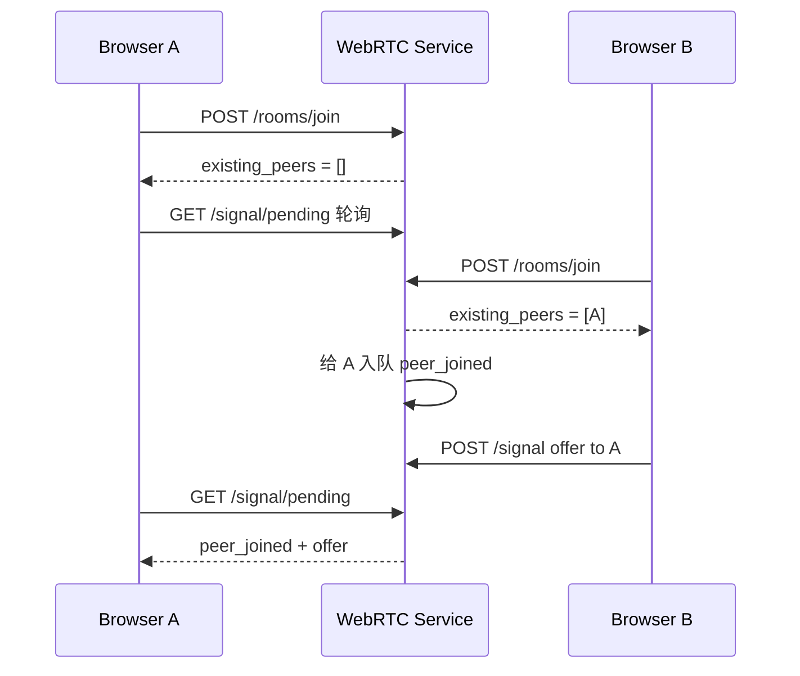
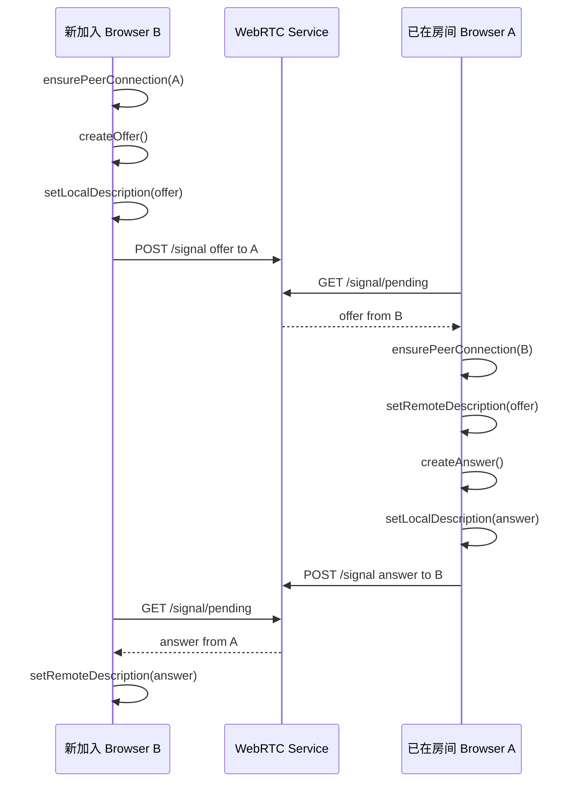
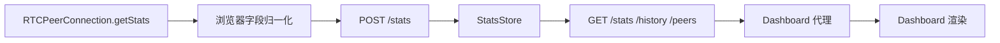
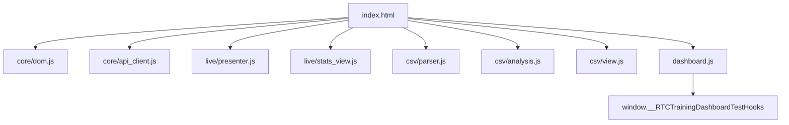
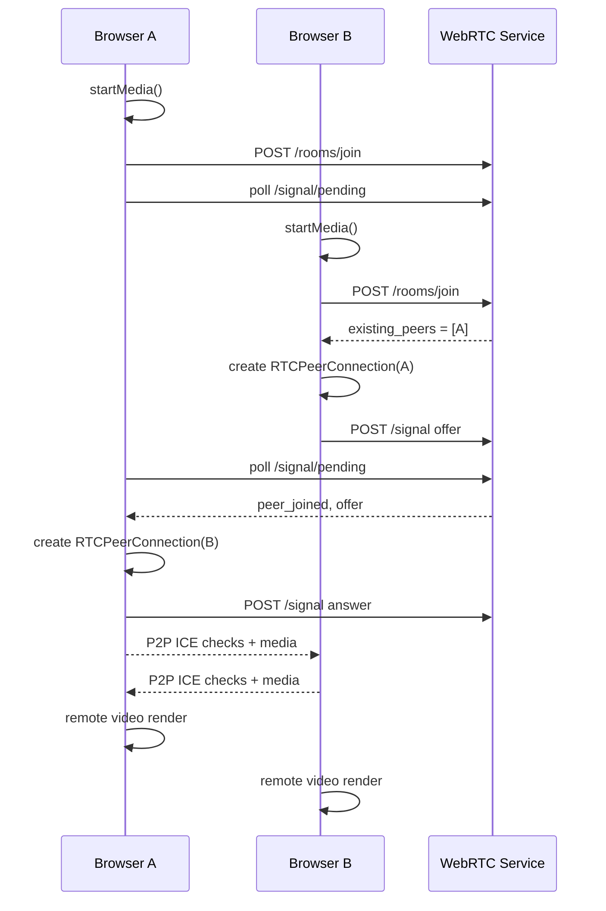
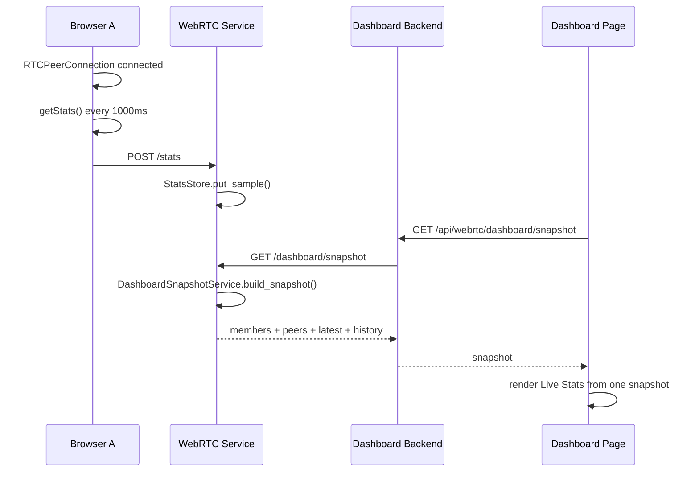

# RTCTraining 前后端设计说明

## 1. 文档范围

本文说明当前 `RTCTraining` 项目的前端、后端、Dashboard、信令、stats 采集、数据查询和页面渲染设计。

当前项目定位是本地/局域网 WebRTC 学习实验仓库，核心目标是让浏览器真实建立 P2P 音视频连接，并把连接状态和媒体质量指标展示出来，便于观察、测试和对比。

新人建议先读本文建立整体认识，再按需阅读：

- `docs/architecture.md`：开源架构边界。
- `docs/api/*.md`：稳定 API、错误 envelope、CSV schema。
- `docs/agents/verification.md`：本地验证入口。
- `docs/agents/playwright_e2e_ci_evaluation.md`：Playwright E2E 进入 CI 的成本评估。

本文只描述当前源码已经实现或已经明确纳入近期计划的内容。以下能力不属于当前系统设计范围：

- 账号、鉴权、联系人、聊天记录。
- TURN、SFU、MCU。
- 公网部署和生产高可用。
- 长期数据库。
- 录制、屏幕共享、服务端混流。
- 生产级监控平台。

## 2. 总体架构

当前系统由两个本地服务和两个浏览器页面组成：



### 2.1 服务边界

| 服务 | 默认地址 | 职责 |
| --- | --- | --- |
| WebRTC 服务 | `https://localhost:8080`，监听 `0.0.0.0:8080` | 提供实验页、房间成员、HTTP 轮询信令、stats 接收与查询、CSV 导出 |
| Dashboard 服务 | `http://127.0.0.1:8081` | 提供 Dashboard 页面，代理查询 WebRTC 服务状态和 stats |

WebRTC 页面直接访问 WebRTC 服务。Dashboard 页面只访问 Dashboard 后端，由 Dashboard 后端转发到 WebRTC 服务。这样可以减少浏览器同时访问跨端口、自签名 HTTPS 和 CORS 带来的干扰。

Dashboard 代理不是通用 HTTP 代理。它只代理固定 WebRTC API 路由，并且 `origin` 必须命中精确 allowlist，例如 `https://localhost:8080`。

### 2.2 代码入口

| 文件 | 职责 |
| --- | --- |
| `src/webrtc/config.py` | 统一读取 `RTC_*` 环境变量和默认端口、目录、origin 配置 |
| `src/webrtc/chat_server.py` | WebRTC 服务 CLI 入口，加载 TLS 证书，启动 aiohttp app |
| `src/webrtc/app.py` | 注册 WebRTC 页面、静态资源、房间、信令、stats API |
| `src/webrtc/api/route_registry.py` | WebRTC 路由注册表，集中声明路由名称和路径 |
| `src/webrtc/services/*` | stats、test session、Dashboard snapshot 的应用服务层 |
| `src/webrtc/domain/*` | 公共错误码和 stats schema 契约 |
| `src/webrtc/exports/stats_csv.py` | CSV 导出字段和渲染逻辑 |
| `src/dashboard/server.py` | Dashboard 服务 CLI 入口、Dashboard 页面和代理 API |
| `src/dashboard/origin_policy.py` | Dashboard 代理 origin allowlist |
| `src/dashboard/proxy_client.py` | Dashboard 上游 WebRTC URL 构造 |
| `templates/webrtc/chat_real.html` | WebRTC 实验页 HTML |
| `templates/dashboard/index.html` | Dashboard 页面 HTML |
| `static/webrtc/*.js`、`static/webrtc/rtc/*`、`static/webrtc/ui/*` | WebRTC 页面状态、信令、媒体、stats 采集和渲染 |
| `static/dashboard/core/*`、`static/dashboard/live/*`、`static/dashboard/csv/*`、`static/dashboard/dashboard.js` | Dashboard 数据查询、live stats、CSV 分析和渲染 |

## 3. 后端架构

后端使用 Python `aiohttp`。当前后端没有数据库，房间、信令队列、stats 和 test session 状态都保存在进程内存中，test session 完成后会把 CSV 写入本地 `data/test_sessions`。



分层职责：

| 层 | 职责 |
| --- | --- |
| API / Handler | 解析请求、校验参数、映射错误、返回统一 JSON envelope |
| Service | 编排 stats、snapshot、test session、CSV 文件写入 |
| Store | 纯 Python 内存状态，不导入 aiohttp |
| Domain / Export | 稳定字段、错误码、CSV schema |

### 3.1 WebRTC 服务路由

| Method | Path | 说明 |
| --- | --- | --- |
| `GET` | `/` | 返回 WebRTC 实验页 |
| `GET` | `/static/webrtc/*` | WebRTC 静态资源 |
| `POST` | `/rooms/join` | 加入房间 |
| `POST` | `/rooms/leave` | 离开房间 |
| `GET` | `/rooms/{roomId}/members` | 查询单个房间成员 |
| `GET` | `/rooms/members` | 查询全部房间快照 |
| `POST` | `/signal` | 发送 offer、answer、candidate 等信令 |
| `GET` | `/signal/pending` | 拉取当前 peer 待处理信令 |
| `POST` | `/stats` | 上传一条 stats 样本 |
| `GET` | `/stats` | 查询 latest stats |
| `GET` | `/stats/history` | 查询历史 stats |
| `GET` | `/stats/peers` | 查询已观察到的 peer pair |
| `GET` | `/dashboard/snapshot` | 查询指定 room 的 Dashboard 原子快照 |
| `GET` | `/stats/export.csv` | 导出 room 维度 CSV |
| `POST` | `/clear_stats` | 清理指定 room 的 stats |
| `POST` | `/stats/test/start` | 开始实验会话 |
| `POST` | `/stats/test/finish` | 结束实验会话并生成 CSV |
| `POST` | `/stats/test/cancel` | 取消实验会话 |
| `GET` | `/stats/test/sessions` | 查询已完成实验会话 |
| `GET` | `/stats/test/download/{file_path}` | 下载实验会话 CSV |

### 3.2 Dashboard 服务路由

| Method | Path | 说明 |
| --- | --- | --- |
| `GET` | `/` | 返回 Dashboard 页面 |
| `GET` | `/static/dashboard/*` | Dashboard 静态资源 |
| `GET` | `/api/webrtc/members` | 代理 WebRTC `/rooms/members` |
| `GET` | `/api/webrtc/stats` | 代理 WebRTC `/stats` |
| `GET` | `/api/webrtc/stats/history` | 代理 WebRTC `/stats/history` |
| `GET` | `/api/webrtc/stats/peers` | 代理 WebRTC `/stats/peers` |
| `GET` | `/api/webrtc/dashboard/snapshot` | 代理 WebRTC `/dashboard/snapshot` |
| `POST` | `/api/webrtc/clear_stats` | 代理 WebRTC `/clear_stats` |
| `GET` | `/api/webrtc/stats/test/sessions` | 代理 WebRTC `/stats/test/sessions` |
| `GET` | `/api/webrtc/stats/test/download/{file_path}` | 代理 WebRTC test session CSV 下载 |

Dashboard 代理接口支持 `origin` 参数：

```text
/api/webrtc/stats?origin=https%3A%2F%2Flocalhost%3A8080&room_id=room1
```

后端会校验 `origin` 必须是 `http` 或 `https` URL，且完整 origin 必须在 `RTC_DASHBOARD_ORIGIN_ALLOWLIST` 中。`localhost` 这类裸 hostname 不会被当成通配符。代理请求使用 3 秒超时，并关闭 TLS 校验以适配本地自签名证书。

### 3.3 响应格式

所有 JSON API 使用统一结构。

成功：

```json
{
  "ok": true,
  "data": {}
}
```

失败：

```json
{
  "ok": false,
  "error": {
    "code": "bad_request",
    "message": "room_id is required",
    "details": {
      "field": "room_id"
    }
  }
}
```

## 4. 关键后端对象

### 4.1 `Settings`

位置：`src/webrtc/config.py`

`Settings` 统一管理本地服务默认值和环境变量覆盖。它只读取 shell 中的 `RTC_*` 环境变量，`.env.example` 是配置样例，不会被程序自动加载。

常用字段：

| 字段 | 默认值 | 说明 |
| --- | --- | --- |
| `webrtc_host` | `0.0.0.0` | WebRTC 服务监听地址 |
| `webrtc_port` | `8080` | WebRTC 服务端口 |
| `dashboard_host` | `127.0.0.1` | Dashboard 服务监听地址 |
| `dashboard_port` | `8081` | Dashboard 服务端口 |
| `local_webrtc_origin` | `https://localhost:8080` | Dashboard 默认访问的 WebRTC origin |
| `dashboard_origin_allowlist` | 本机 `localhost` / `127.0.0.1` origin | Dashboard 代理允许访问的 WebRTC origin |

### 4.2 `RoomStore`

位置：`src/webrtc/room_store.py`

`RoomStore` 是纯 Python 内存对象，不依赖 aiohttp。它负责房间成员和信令消息队列。

核心字段：

```python
{
    room_id: {
        "members": {
            peer_id: {
                "client_id": peer_id,
                "display_name": display_name,
                "joined_at": timestamp,
                "last_seen": timestamp,
                "active": True
            }
        },
        "pending_messages": {
            peer_id: [message, ...]
        },
        "last_activity": timestamp,
        "max_members": 3
    }
}
```

核心方法：

| 方法 | 说明 |
| --- | --- |
| `join_room(room_id, client_id, display_name)` | 加入房间，返回已有 peer；向其他成员发送 `peer_joined` |
| `leave_room(room_id, client_id)` | 离开房间；向其他成员发送 `peer_left` |
| `list_members(room_id)` | 返回指定房间成员 |
| `snapshot()` | 返回所有房间成员和待处理消息数量 |
| `send_signal(...)` | 校验发送者和接收者，写入接收者 pending queue |
| `pop_pending(room_id, client_id)` | 取出并清空当前 peer 的 pending queue |

房间默认最多 3 人，为后续 Mesh 学习场景预留。

### 4.3 `MeshHandlers`

位置：`src/webrtc/mesh_handlers.py`

`MeshHandlers` 是 HTTP 层适配器。它只做这些事情：

- 读取 JSON body 或 query。
- 校验必填字段。
- 调用 `RoomStore`。
- 把异常映射为 HTTP 状态码和统一 JSON 响应。

错误映射：

| 异常 | HTTP 状态 | code |
| --- | --- | --- |
| 缺少字段 | `400` | `bad_request` |
| 非法信令类型 | `400` | `bad_request` |
| 房间满员 | `409` | `room_full` |
| peer 不存在 | `404` | `not_found` |

### 4.4 `StatsStore`

位置：`src/webrtc/stats_store.py`

`StatsStore` 是纯 Python 内存对象，负责保存浏览器上传的 stats 样本。

样本分区 key：

```text
(room_id, peer_id, remote_peer_id, test_session_id)
```

隔离维度：

| 字段 | 说明 |
| --- | --- |
| `room_id` | 房间 |
| `peer_id` | 上传样本的本端 peer |
| `remote_peer_id` | 当前样本对应的远端 peer |
| `test_session_id` | 实验会话，可为空 |

内部维护两份索引：

| 字段 | 类型 | 说明 |
| --- | --- | --- |
| `_latest` | dict | 每个 peer pair 的最新样本 |
| `_history` | dict + deque | 每个 peer pair 的历史样本，默认最多 300 条 |

写入时会补充：

- `timestamp`：请求未传时使用服务端当前时间。
- `sample_index`：服务进程内单调递增序号。
- `test_session_id`：未传时保留为 `None`。
- `metrics`：复制为普通 dict，避免外部引用影响存储内容。

### 4.5 `StatsService`

位置：`src/webrtc/services/stats_service.py`

`StatsService` 是 stats 应用服务层，封装 `StatsStore` 查询和 CSV 导出。HTTP 层不直接拼 CSV，也不直接知道 CSV 渲染细节。

| 方法 | 说明 |
| --- | --- |
| `record_sample(sample)` | 写入一条浏览器 stats 样本 |
| `latest(...)` | 查询 latest stats |
| `history(...)` | 查询历史 stats |
| `peers(room_id=...)` | 查询已观察到的 peer pair |
| `clear(room_id=...)` | 清理指定 room 的 stats |
| `export_csv(...)` | 按过滤条件导出 CSV 文本 |

### 4.6 `DashboardSnapshotService`

位置：`src/webrtc/services/dashboard_snapshot_service.py`

`DashboardSnapshotService` 用于生成 room 级原子快照。它同时读取 `RoomStore` 和 `StatsStore`，并过滤掉已经离开房间的 peer pair，避免 Dashboard 显示过期连接。

返回字段：

| 字段 | 说明 |
| --- | --- |
| `room_id` | 当前 room |
| `stats_revision` | room 级 stats 版本号 |
| `server_time` | 服务端生成快照时间 |
| `members` | 当前 active 成员 |
| `peers` | active peer pair |
| `latest` | active peer pair 最新样本 |
| `history` | active peer pair 历史样本 |

### 4.7 `TestSessionService`

位置：`src/webrtc/services/test_session_service.py`

`TestSessionService` 负责实验会话生命周期和 CSV 文件输出。

| 方法 | 说明 |
| --- | --- |
| `start(payload)` | 开始实验会话 |
| `finish(test_session_id)` | 结束会话，计算实际时长，按 remote peer 输出 CSV 文件 |
| `cancel(test_session_id)` | 取消会话 |
| `list_finished(room_id=...)` | 查询已完成会话 |
| `resolve_download(relative_path)` | 校验并解析 CSV 下载路径 |

CSV 下载响应只暴露相对路径、可读文件名、展示名和下载 URL，不把本机绝对路径返回给浏览器。

实验会话开始时可记录 `display_name` 和 `planned_duration_seconds`。完成后返回 `duration_seconds`，CSV 文件名包含开始时间、用户名、peer pair、preset、NACK、ABR、bitrate 和实际时长，便于 Dashboard 下拉选择和多次实验对比。

### 4.8 `StatsHandlers`

位置：`src/webrtc/stats_handlers.py`

`StatsHandlers` 是 stats HTTP 层适配器。它负责参数校验、错误映射和响应 envelope，实际写入、查询、CSV 导出由 `StatsService` 完成。

`POST /stats` 必填字段：

```json
{
  "room_id": "room1",
  "peer_id": "peer-a",
  "remote_peer_id": "peer-b",
  "test_session_id": null,
  "metrics": {}
}
```

`metrics` 必须是对象。当前支持的常见指标：

| 字段 | 单位 | 说明 |
| --- | --- | --- |
| `connection_state` | 文本 | `RTCPeerConnection.connectionState` |
| `ice_connection_state` | 文本 | `RTCPeerConnection.iceConnectionState` |
| `rtt_ms` | ms | candidate pair RTT |
| `packets_sent` | count | 已发送包数 |
| `packets_received` | count | 已接收包数 |
| `packets_lost` | count | 丢包数 |
| `jitter_ms` | ms | RTP jitter |
| `bitrate_kbps` | kbps | 按 bytes 增量计算 |
| `fps` | frame/s | 视频帧率 |
| `frame_width` | px | 视频宽 |
| `frame_height` | px | 视频高 |
| `codec` | 文本 | codec MIME type |
| `bytes_sent` | bytes | 已发送字节数 |
| `bytes_received` | bytes | 已接收字节数 |
| `nack_count` | count | NACK 数 |
| `pli_count` | count | PLI 数 |
| `fir_count` | count | FIR 数 |

CSV 导出字段：

```text
sample_index,timestamp,room_id,test_session_id,peer_id,remote_peer_id,
connection_state,ice_connection_state,rtt_ms,packets_sent,packets_received,
packets_lost,packet_loss_rate,jitter_ms,bitrate_kbps,fps,frame_width,
frame_height,codec,bytes_sent,bytes_received,nack_enabled,nack_mode,
nack_count,pli_count,fir_count,sender_bitrate_mode,sender_max_bitrate_bps,
abr_mode,abr_target_bitrate_bps,abr_decision
```

## 5. 前端架构

前端使用原生 HTML、CSS 和 JavaScript。当前没有构建链和前端框架。



### 5.1 页面结构

WebRTC 页面主要区域：

| DOM | 说明 |
| --- | --- |
| `connectionState` | 当前连接状态文本 |
| `roomIdInput` | 房间输入 |
| `displayNameInput` | 昵称输入 |
| `startMediaButton` | 启动本地媒体 |
| `joinRoomButton` | 加入房间 |
| `leaveRoomButton` | 离开房间 |
| `localVideo` | 本地预览 |
| `remoteVideos` | 远端视频容器 |
| `timeline` | 建联和错误事件时间线 |
| `nackModeSelect` / `nackModeState` | NACK 实验开关和状态 |
| `senderBitrateInput` / `bitrateModeState` | 发送端码率实验输入和状态 |
| `abrModeSelect` / `abrModeState` | 简化 ABR 实验开关和决策状态 |
| `testPresetSelect` / `testSessionState` | 实验会话 preset 和生命周期状态 |

### 5.2 全局状态对象

位置：`static/webrtc/chat_real_shared.js`

```javascript
const state = {
  clientId: `peer-${crypto.randomUUID()}`,
  roomId: "room1",
  connectionState: "idle",
  peers: {},
  peerConnections: {},
  remoteStreams: {},
  pendingCandidates: {},
  statsTimer: null,
  statsUploadInFlight: false,
  statsPrevious: {},
  statsUploadedCount: 0,
  latestStats: {},
  timeline: [],
  localStream: null,
  pollingTimer: null,
  nackMode: "enabled",
  senderBitrateMode: "auto",
  abrMode: "off",
  testSession: null
};
```

关键字段说明：

| 字段 | 说明 |
| --- | --- |
| `clientId` | 当前浏览器 peer id，页面加载时生成 |
| `roomId` | 当前房间 |
| `connectionState` | 页面级连接状态 |
| `peers` | 已知远端 peer |
| `peerConnections` | `remotePeerId -> RTCPeerConnection` |
| `remoteStreams` | `remotePeerId -> MediaStream` |
| `pendingCandidates` | remote description 尚未设置时暂存 ICE candidate |
| `statsPrevious` | 计算 bitrate 所需的上一轮 bytes 和时间 |
| `latestStats` | 已上传且服务端返回的最新样本 |
| `timeline` | 页面可观察事件 |
| `nackMode` | NACK SDP munging 开关 |
| `senderBitrateMode` | 发送端码率模式 |
| `abrMode` | 简化 ABR 开关 |
| `testSession` | 当前运行中的实验会话 |

### 5.3 页面状态

当前页面会写入这些主要状态：

| 状态 | 触发点 |
| --- | --- |
| `idle` | 页面初始状态 |
| `media_requesting` | 点击 Start Media 后请求摄像头和麦克风 |
| `media_ready` | 本地媒体获取成功 |
| `joining` | 正在加入房间 |
| `joined` | 加入房间成功 |
| `connected` | 任一 `RTCPeerConnection` 进入 connected/completed |
| `left` | 离开房间后 |
| `failed` | 媒体或 join 失败 |

事件时间线由 `addTimelineEvent(type, details)` 写入，事件包含：

```javascript
{
  event_id,
  timestamp,
  room_id,
  peer_id,
  remote_peer_id,
  category,
  type,
  direction,
  summary,
  details
}
```

### 5.4 测试钩子

页面暴露 `window.__RTCTrainingTestHooks`，供 Playwright 读取状态和驱动页面：

| 方法 | 说明 |
| --- | --- |
| `getState()` | 返回页面连接状态 |
| `getClientId()` | 返回当前 peer id |
| `getRoomId()` | 返回当前 room id |
| `getPeers()` | 返回已知 peer |
| `getTimeline()` | 返回事件时间线 |
| `getConnectedPeerCount()` | 返回 connected peer 数量 |
| `getConnectedPeerIds()` | 返回 connected remote peer ids |
| `getRemoteVideoCount()` | 返回远端 video 元素数量 |
| `getStatsUploadedCount()` | 返回 stats 上传次数 |
| `getLatestStats()` | 返回最新 stats |
| `getNackMode()` / `setNackMode()` | 读取或设置 NACK 模式 |
| `getBitrateMode()` / `setSenderBitrateKbps()` | 读取或设置发送端码率 |
| `getAbrMode()` / `setAbrMode()` / `runAbrDecision()` | 读取、设置和触发简化 ABR 决策 |
| `startTestSession()` / `finishTestSession()` / `cancelTestSession()` | 驱动实验会话 |
| `startMedia()` | 触发本地媒体 |
| `joinRoom(roomId, displayName)` | 加入房间 |
| `leaveRoom()` | 离开房间 |

## 6. 信令机制

当前信令通过 HTTP 轮询实现。服务端只负责传递应用层消息，不参与媒体协商，也不解析 SDP。

### 6.1 信令类型

客户端可发送：

| type | 说明 |
| --- | --- |
| `offer` | 发起方创建的 SDP offer |
| `answer` | 接收方创建的 SDP answer |
| `candidate` | ICE candidate |
| `renegotiate` | 为后续重协商预留 |

服务端生成：

| type | 说明 |
| --- | --- |
| `peer_joined` | 新 peer 加入，通知已有成员 |
| `peer_left` | peer 离开，通知剩余成员 |

### 6.2 信令消息结构

```json
{
  "type": "offer",
  "from_peer_id": "peer-a",
  "to_peer_id": "peer-b",
  "payload": {}
}
```

`payload` 对服务端透明。对于 `offer` 和 `answer`，它是浏览器 `RTCSessionDescription.toJSON()` 结果。对于 `candidate`，它是 `RTCIceCandidate.toJSON()` 结果。

### 6.3 加入房间流程



当前实现中，新加入者会对 `existing_peers` 主动创建 offer。已有成员收到 `peer_joined` 后只更新本地 peer 列表，不主动创建 offer。

### 6.4 Offer / Answer 流程



### 6.5 ICE Candidate 流程

每个 `RTCPeerConnection` 注册 `icecandidate` 事件。浏览器产生 candidate 后立即发送：

```text
POST /signal
type = candidate
payload = event.candidate.toJSON()
```

接收方处理逻辑：

1. 找到或创建对应 `RTCPeerConnection`。
2. 如果 `remoteDescription` 已设置，立即 `addIceCandidate()`。
3. 如果 `remoteDescription` 尚未设置，先放入 `pendingCandidates[remotePeerId]`。
4. 当 offer 或 answer 设置 remote description 后，调用 `flushPendingCandidates(remotePeerId)`。

这个设计避免 candidate 早于 SDP 到达时触发浏览器异常。

### 6.6 轮询策略

浏览器每 250ms 请求：

```text
GET /signal/pending?room_id=room1&client_id=peer-a
```

服务端返回并清空该 peer 的 pending queue：

```json
{
  "ok": true,
  "data": {
    "messages": []
  }
}
```

离开房间时前端停止信令轮询，并关闭所有 peer connection。

## 7. 媒体连接机制

### 7.1 本地媒体

点击 `Start Media` 后：

```javascript
navigator.mediaDevices.getUserMedia({ audio: true, video: true })
```

成功后：

- 保存到 `shared.state.localStream`。
- 设置 `localVideo.srcObject`。
- 状态更新为 `media_ready`。
- 时间线写入 `local_media_ready`。

### 7.2 PeerConnection 创建

`ensurePeerConnection(remotePeerId)` 负责创建和复用连接：

```javascript
const peerConnection = new RTCPeerConnection({ iceServers: [] });
```

当前不配置 STUN/TURN，适合本地和局域网 host candidate 实验。

创建后会：

- 保存到 `peerConnections[remotePeerId]`。
- 初始化 `pendingCandidates[remotePeerId]`。
- 把本地 stream tracks 加入 peer connection。
- 监听 `icecandidate`，发送 candidate。
- 监听 `track`，渲染远端视频。
- 监听 connection state 和 ICE state。

### 7.3 远端视频渲染

收到 `track` 事件后调用 `ensureRemoteVideo(remotePeerId, stream)`：

1. 保存 `remoteStreams[remotePeerId] = stream`。
2. 在 `#remoteVideos` 下查找 `remoteVideo-${remotePeerId}`。
3. 不存在则创建 `<video autoplay playsInline>`。
4. 设置 `video.srcObject = stream`。

peer 离开时会关闭连接并删除对应远端 video。

## 8. Stats 数据同步机制

Stats 数据链路：



### 8.1 采集启动条件

前端在 `updateConnectedState()` 中判断连接状态：

```javascript
["connected", "completed"].includes(peerConnection.iceConnectionState) ||
peerConnection.connectionState === "connected"
```

只要存在 connected peer，就把页面状态设置为 `connected`，并启动 `RTCTrainingStats.start()`。

### 8.2 采集周期

`chat_real_stats.js` 中配置：

```javascript
const STATS_INTERVAL_MS = 1000;
```

启动后立即采集一次，之后每秒采集一次。

为了避免上一次上传还未结束又开始新一轮上传，前端使用：

```javascript
statsUploadInFlight
```

当它为 `true` 时，本轮采集直接返回。

### 8.3 字段归一化

每个 remote peer 单独调用：

```javascript
peerConnection.getStats()
```

然后遍历 report：

| report type | 使用字段 |
| --- | --- |
| `candidate-pair` 且 `state === "succeeded"` | `currentRoundTripTime -> rtt_ms` |
| `codec` | `mimeType -> codec` |
| `outbound-rtp` | packets、bytes、frame、fps、nack、pli、fir |
| `inbound-rtp` | packets、bytes、loss、jitter、frame、fps、nack、pli、fir |

bitrate 计算：

```text
bitrate_kbps =
  (本轮 bytes_sent + bytes_received - 上轮 bytes_total) * 8
  / 间隔秒数
  / 1000
```

首个样本没有上轮数据，`bitrate_kbps` 为 `null`。

### 8.4 上传样本结构

```json
{
  "room_id": "room1",
  "peer_id": "peer-a",
  "remote_peer_id": "peer-b",
  "test_session_id": null,
  "metrics": {
    "connection_state": "connected",
    "ice_connection_state": "connected",
    "rtt_ms": 12.5,
    "packets_sent": 100,
    "packets_received": 98,
    "packets_lost": 0,
    "jitter_ms": 3.2,
    "bitrate_kbps": 850.4,
    "fps": 30,
    "frame_width": 640,
    "frame_height": 480,
    "codec": "video/VP8",
    "bytes_sent": 120000,
    "bytes_received": 118000,
    "nack_count": 0,
    "pli_count": 0,
    "fir_count": 0
  }
}
```

服务端返回的 `sample` 会写入：

```javascript
shared.state.latestStats[sample.remote_peer_id] = payload.data.sample;
shared.state.statsUploadedCount += 1;
```

### 8.5 查询过滤

`GET /stats` 和 `GET /stats/history` 支持：

| query | 是否必填 | 说明 |
| --- | --- | --- |
| `room_id` | 是 | 房间 |
| `peer_id` | 否 | 本端 peer |
| `remote_peer_id` | 否 | 远端 peer |
| `test_session_id` | 否 | 实验会话 |

`GET /stats/peers` 只需要 `room_id`。

`POST /clear_stats` 只清理指定 `room_id` 的 stats，不影响其他房间。

## 9. Dashboard 数据同步与渲染

Dashboard 页面由 `templates/dashboard/index.html`、`static/dashboard/dashboard.js` 和拆分后的 core/live/csv 模块组成。



### 9.1 页面结构

| DOM | 说明 |
| --- | --- |
| `serviceState` | WebRTC 服务状态 |
| `checkServiceButton` | 手动检查服务按钮 |
| `webrtcOriginInput` | WebRTC 服务 origin |
| `roomSummary` | 当前 WebRTC 服务房间数量 |
| `statsRoomInput` | 要观察的 room id |
| `livePeerPairSelect` | Live Stats peer pair 过滤 |
| `liveMetricSelect` | Live Trend 指标选择 |
| `liveTrendChart` | 当前 peer pair 的实时趋势图 |
| `statsState` | stats 查询状态 |
| `peerPairList` | 已观察到的 peer pair |
| `latestStatsPanel` | 最新 stats |
| `statsHistoryTable` | 最近历史样本 |
| `csvFileInput` | 多 CSV 文件输入 |
| `csvState` | CSV 分析状态 |
| `csvSummaryTable` | CSV 汇总对比 |
| `csvTrendChart` | CSV 趋势图 |
| `testSessionList` | 已完成实验会话列表 |

### 9.2 启动流程

页面 DOMContentLoaded 后：

1. 读取 URL 参数 `webrtc_origin`，写入 `webrtcOriginInput`。
2. 读取 URL 参数 `room_id`，写入 `statsRoomInput`。
3. 绑定 `checkServiceButton`。
4. 暴露 `window.__RTCTrainingDashboardTestHooks`。
5. 调用 `checkService()`。
6. 调用 `loadLiveStats()`。
7. 每 1000ms 调用一次 `loadLiveStats()`。

### 9.3 服务状态查询

`checkService()` 请求：

```text
GET /api/webrtc/members?origin=<encoded_origin>
```

成功后：

- `serviceState = service_online`
- `roomSummary = N rooms`

失败后：

- `serviceState = payload.error.code`
- `roomSummary = 0 rooms`

### 9.4 Live Stats 快照查询

Live Stats 使用 room 级 snapshot 查询，不在前端同时拼接 members、peers、latest、history 多个响应。

```text
GET /api/webrtc/dashboard/snapshot?origin=<encoded_origin>&room_id=room1
```

Dashboard 后端代理 WebRTC 服务：

```text
GET /dashboard/snapshot?room_id=room1
```

WebRTC 服务在同一个进程内读取 `RoomStore` 和 `StatsStore`，返回当前 room 的一致数据：

```json
{
  "ok": true,
  "data": {
    "room_id": "room1",
    "stats_revision": 12,
    "server_time": 1778053000.123,
    "members": [
      {"peer_id": "peer-a", "display_name": "Alice"}
    ],
    "peers": [],
    "latest": [],
    "history": []
  }
}
```

字段规则：

| 字段 | 说明 |
| --- | --- |
| `stats_revision` | room 级 stats 版本号。stats 写入和清理都会递增 |
| `server_time` | WebRTC 服务生成的快照时间 |
| `members` | 当前 room 成员，用于构建 `Alice (peer-...)` 标签 |
| `peers` | 当前 stats 历史中观察到的 peer pair |
| `latest` | 每个 peer pair 最新样本 |
| `history` | 当前 room 最近历史样本 |

前端只渲染 snapshot，不再把不同时间返回的多个响应混合到同一屏。

如果 `peers` 为空：

- 清空 peer pair 列表。
- 清空 latest stats。
- 清空 history table。
- `statsState = service_online_but_no_stats`。

如果 `peers` 非空：

- 渲染 peer pair。
- 渲染 latest stats。
- 渲染最近 20 条 history。
- 按当前 `livePeerPairSelect` 过滤 latest、history 和 live trend。
- `statsState = stats_online`。

### 9.5 Live Stats 刷新边界

Dashboard 按数据所有权划分刷新范围：

| 区域 | 刷新方式 | 说明 |
| --- | --- | --- |
| `serviceState` / `roomSummary` | 局部刷新 | 来自服务成员摘要，表示 WebRTC 服务是否可达 |
| `Live Stats` 整区 | 全区刷新 | `statsState`、`statsRefreshState`、`peerPairList`、`latestStatsPanel`、`statsHistoryTable` 来自同一个 snapshot |
| `CSV Analysis` | 局部刷新 | CSV 分析有独立数据来源 |

Live Stats 前端维护最小状态：

```javascript
{
  origin,
  roomId,
  requestSeq,
  clearing,
  snapshot,
  selectedPeerPair,
  metric,
  statsState,
  lastUpdatedAt
}
```

每次 snapshot 请求都会生成新的 `requestSeq`。响应回来后，如果该响应不是当前最新请求，前端直接忽略，避免旧请求晚返回后覆盖清理后的空状态。

清理当前 room stats 是一个完整事务：

1. 设置 `clearing = true`。
2. 递增 `requestSeq`，让清理前已发出的请求失效。
3. 请求 `POST /api/webrtc/clear_stats`。
4. WebRTC 服务清理指定 room 的 stats，并递增 `stats_revision`。
5. Dashboard 用清理接口返回的 snapshot 渲染 Live Stats 整区。
6. 设置 `clearing = false`，恢复轮询。

清理期间轮询不能写入 Live Stats。任何清理前发出的 snapshot 响应，即使晚返回，也不能更新 DOM。

### 9.6 渲染策略

peer pair：

```text
[last_sample: 2026/5/6 18:30:00] Alice (peer-a...) -> Bob (peer-b...)
```

latest stats 会按 peer pair 取最新样本渲染：

| Label | 指标 |
| --- | --- |
| Peer | `peer_id -> remote_peer_id` |
| RTT | `metrics.rtt_ms` |
| Loss | `metrics.packets_lost` |
| Jitter | `metrics.jitter_ms` |
| Bitrate | `metrics.bitrate_kbps` |
| FPS | `metrics.fps` |
| Resolution | `frame_width x frame_height` |
| Codec | `metrics.codec` |

history table 当前展示最近 20 条，按最新在前渲染：

| 列 | 来源 |
| --- | --- |
| Time | `sample.timestamp` |
| Peer | `sample.peer_id` |
| Remote | `sample.remote_peer_id` |
| RTT | `metrics.rtt_ms` |
| Loss | `metrics.packets_lost` |
| Jitter | `metrics.jitter_ms` |
| Bitrate | `metrics.bitrate_kbps` |
| FPS | `metrics.fps` |

peer 和 remote 使用成员别名映射。当前成员表没有对应别名时，显示短 ID。

时间显示规则：

| 情况 | 显示 |
| --- | --- |
| `timestamp` 有值 | 本地时间字符串 |
| `timestamp` 为空且有 `sample_index` | `unknown_time; sample #N` |
| 两者都没有 | `unknown_time` |

空指标值显示为 `-`。

Live Trend 使用当前 snapshot history 本地计算，不新增后端接口。支持指标：

| 指标 | 字段 |
| --- | --- |
| RTT | `metrics.rtt_ms` |
| Loss Rate | `metrics.packet_loss_rate` |
| Jitter | `metrics.jitter_ms` |
| Bitrate | `metrics.bitrate_kbps` |
| FPS | `metrics.fps` |

当 `livePeerPairSelect = all` 时，趋势图使用当前 snapshot 中所有方向的历史样本。选中单个 `peer_id -> remote_peer_id` 后，latest、history 和 trend 都只展示该方向。

### 9.7 CSV 趋势图横坐标

CSV 原始 `sample_index` 表示 WebRTC 服务进程内的单调递增序号。Dashboard 分析多份 CSV 时，不直接用原始 `sample_index` 作为趋势图横坐标。

渲染规则：

- 每份 CSV 单独计算自身最小 `sample_index`。
- 图表横坐标使用 `sample_index - min_sample_index`，从 0 开始。
- `sample_index` 缺失或非法时，使用该 CSV 内的行序号。
- CSV 原始 rows、汇总统计和导出文件不改写。

这样可以对齐不同时间导出的 CSV，让横坐标表达“本次实验开始后的第 N 个样本”。

### 9.8 Dashboard 测试钩子

`window.__RTCTrainingDashboardTestHooks`：

| 方法 | 说明 |
| --- | --- |
| `checkService()` | 手动触发服务检查 |
| `loadLiveStats()` | 手动触发 snapshot 查询 |
| `clearLiveStats()` | 清理当前 room stats 并重绘 Live Stats 整区 |
| `getServiceState()` | 返回服务状态 |
| `getStatsState()` | 返回 stats 状态 |
| `getStatsRefreshState()` | 返回最近刷新信息 |
| `getRoomSummary()` | 返回房间摘要 |
| `setLivePeerPair()` | 设置 Live Stats peer pair 过滤 |
| `setLiveMetric()` | 设置 Live Trend 指标 |
| `analyzeCsvTexts()` | 测试 CSV 解析和汇总 |
| `setCsvMetric()` | 切换 CSV 趋势指标 |
| `loadTestSessionCsvList()` | 加载已完成 test session CSV 列表 |
| `loadSelectedSessionCsv()` | 加载选中的 test session CSV |

## 10. 端到端数据流程

### 10.1 双浏览器建联流程



### 10.2 Stats 到 Dashboard 流程



## 11. 数据隔离设计

### 11.1 房间隔离

房间成员、信令队列和 stats 查询都以 `room_id` 为第一隔离维度。

影响：

- 一个房间的信令不会投递到另一个房间。
- `/stats` 查询必须传 `room_id`。
- `/clear_stats` 只清理指定房间。
- CSV 导出只导出指定房间历史样本。

### 11.2 Peer Pair 隔离

Stats 按方向保存：

```text
peer-a -> peer-b
peer-b -> peer-a
```

这两个方向是两组样本。这样可以观察上行和下行视角差异，也适配后续 Mesh 场景。

### 11.3 Test Session 隔离

`test_session_id` 可以为空。字段已经进入 `StatsStore` 分区 key 和查询过滤。运行实验会话时，前端会把当前 session id 写入 stats 上传样本。

完成 test session 后，服务端按 `room_id / test_session_id / peer_id / readable_filename.csv` 输出 CSV 文件，并通过下载接口提供给 Dashboard。文件名仍在 session 目录下隔离，避免不同实验互相覆盖。

## 12. CSV 导出设计

当前 WebRTC 服务提供：

```text
GET /stats/export.csv?room_id=room1
```

可选过滤：

```text
peer_id
remote_peer_id
test_session_id
```

响应：

- `Content-Type: text/csv`
- `Content-Disposition: attachment; filename="room1-stats.csv"`

CSV 有两个使用场景：

| 场景 | 说明 |
| --- | --- |
| 手工导出 | `GET /stats/export.csv` 导出当前 room 历史样本 |
| 实验会话 | `TestSessionService.finish()` 按 remote peer 输出 CSV，并通过 Dashboard 加载 |

Dashboard 已支持多 CSV 对比、字段校验、汇总表和趋势图。CSV schema 以 `docs/api/csv_schema.md` 和 `src/webrtc/exports/stats_csv.py` 为准。

实验会话 CSV 文件名格式：

```text
YYYYMMDD-HHMMSSZ_<display_name>_<peer_id>_to_<remote_peer_id>_<preset>_nack-<mode>_abr-<mode>_bitrate-<value>_<duration>s.csv
```

`csv_files[].display_name` 用于 Dashboard 下拉展示，优先显示人名、peer pair、preset、参数配置、实际时长和开始时间。

CSV Analysis 会自动生成实验对比结论：

| 对比 | 来源字段 | 输出 |
| --- | --- | --- |
| NACK | `nack_mode` + `packet_loss_rate` | 比较 enabled / disabled 平均丢包率 |
| ABR | `abr_mode` + `bitrate_kbps` | 比较 on / off 平均码率 |
| Bitrate | `sender_max_bitrate_bps` | 展示最高配置目标码率 |

## 13. 错误与降级处理

### 13.1 WebRTC 页面

| 场景 | 行为 |
| --- | --- |
| 获取媒体失败 | 页面状态 `failed`，时间线写入 `media_error` |
| 加入房间失败 | 页面状态 `failed`，时间线写入 `join_room_failed` |
| 发送信令失败 | 时间线写入 `signal_error` |
| 拉取 pending 信令失败 | 时间线写入 `poll_signal_failed` |
| stats 上传失败 | 时间线写入 `stats_upload_failed` |

### 13.2 Dashboard 页面

| 场景 | 行为 |
| --- | --- |
| WebRTC 服务不可达 | Dashboard 后端返回 `service_unreachable` |
| WebRTC 上游返回 `ok=false` | Dashboard 后端返回 `upstream_error` |
| peers 为空 | 页面显示 `service_online_but_no_stats` |
| stats 查询异常 | 页面显示 `stats_error` |

## 14. 测试设计

当前测试分层：

| 测试 | 覆盖内容 |
| --- | --- |
| `tests/test_config.py` | 默认配置和环境变量覆盖 |
| `tests/test_room_store.py` | 房间、成员、信令队列 |
| `tests/test_mesh_handlers.py` | join、leave、signal、pending HTTP API |
| `tests/test_stats_store.py` | stats latest/history/peers/clear |
| `tests/test_stats_service.py` | stats service 和 CSV export 边界 |
| `tests/test_stats_handlers.py` | stats API、CSV 导出 |
| `tests/test_test_session_service.py` | test session CSV 文件和下载路径安全 |
| `tests/test_test_session_handlers.py` | test session HTTP API |
| `tests/test_dashboard_origin_policy.py` | Dashboard exact origin allowlist |
| `tests/test_dashboard_proxy_client.py` | Dashboard 上游 URL 构造 |
| `tests/test_dashboard_snapshot_service.py` | Dashboard snapshot 聚合和 active peer 过滤 |
| `tests/test_domain_contracts.py` | stats schema 和公共错误码 |
| `tests/test_open_source_docs.py` | 架构/API 文档契约 |
| `tests/test_open_source_entrypoints.py` | README、CONTRIBUTING、SECURITY、CI 入口 |
| `tests/test_harness.py` | lightweight harness helpers |
| `tests/test_ui_routes.py` | WebRTC 页面、Dashboard 页面、静态资源和代理路由 |
| `tests/test_cli.py` | CLI 入口 smoke |
| `tests/test_playwright_e2e.py` | 双 Chrome P2P 建联、远端视频、stats 上传、Dashboard 代理 |

常用验证命令：

```bash
make test-unit
make harness-smoke
make test-e2e
make test
```

GitHub CI 当前运行两个阶段：

1. `make test-unit`
2. `make harness-smoke`

`make test-e2e` 当前仍作为本地合并前验证，暂不进入 CI。

## 15. 当前限制

| 限制 | 当前状态 |
| --- | --- |
| 浏览器 | 首版面向桌面 Chrome |
| 信令 | HTTP 轮询，每 250ms |
| 媒体网络 | 无 STUN/TURN，适合本机和局域网 |
| 存储 | 进程内存，服务重启后丢失 |
| stats history | 每个 peer pair 默认最多 300 条 |
| Dashboard proxy | 只允许 exact origin allowlist 中的 WebRTC origin |
| Dashboard 图表 | CSV 趋势图已实现，Live Stats 仍以实时列表/表格为主 |
| Live Trend | 前端基于 snapshot history 渲染，不做长期存储 |
| harness | 服务级 smoke，不替代 pytest 或 Playwright |
| CI | 已跑 unit 和 harness smoke，E2E 暂不进 CI |

## 16. 后续设计方向

后续开发应保持当前边界：

- WebRTC 服务继续负责实验页、信令、stats 写入和 CSV 导出。
- Dashboard 服务继续负责页面和查询代理。
- `RoomStore`、`StatsStore` 保持纯 Python 对象，便于单元测试。
- HTTP handler 只做请求解析、参数校验、错误映射和 JSON envelope。
- 业务流程放 service，CSV/report 放 export。
- 前端继续暴露测试钩子，状态不能只存在 DOM 文本中。
- 新能力先明确 API、状态、数据结构和测试，再进入实现。

优先级较高的下一步：

1. 试运行 Playwright E2E 的非必选 CI job，观察稳定性和耗时。
2. 增强 Live Stats 的 peer pair 选择和趋势观察。
3. 扩展 NACK、bitrate、ABR 自动实验对比。
4. 增强 Mesh 拓扑和每条边的 stats 展示。
