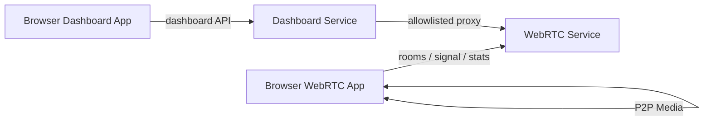

# Open Source Architecture Refactor Implementation Plan

> **For agentic workers:** REQUIRED SUB-SKILL: Use superpowers:subagent-driven-development (recommended) or superpowers:executing-plans to implement this plan task-by-task. Steps use checkbox (`- [ ]`) syntax for tracking.

**Goal:** 将 RTCTraining 从本地实验 Demo 形态重构为边界清晰、契约稳定、易读易扩展、带轻量验证 harness 的开源 WebRTC 实验平台。

**Architecture:** 保留当前轻量技术栈和双服务边界。后端从 handler 直连 store 调整为 `api -> services -> domain/storage/exports`，前端从大文件脚本调整为 `core / live / csv / rtc / ui` 模块，文档和测试固定公开契约。

**Tech Stack:** Python 3, aiohttp, pytest, pytest-aiohttp, Playwright Python, vanilla HTML/CSS/JavaScript, self-signed HTTPS, Makefile, GitHub Actions.

---

## 0. 重构边界

本计划只做架构、契约、可维护性和开源工程化重构。

不做：

- 引入 React/Vue/Svelte 等前端框架。
- 引入数据库。
- 引入账号、鉴权、TURN、SFU、MCU。
- 改变默认端口和本地/局域网定位。
- 改变现有 API envelope：`{"ok": true, "data": {}}` 和 `{"ok": false, "error": {"code": "bad_request", "message": "room_id is required", "details": {"field": "room_id"}}}`。
- 移除 `window.__RTCTrainingTestHooks`。
- 把 harness 做成任务调度系统或替代现有 pytest/Playwright 测试。

## 1. 目标文件结构

### 后端

```text
src/webrtc/
  api/
    __init__.py
    route_registry.py
    room_routes.py
    stats_routes.py
    test_session_routes.py
    ui_routes.py

  services/
    __init__.py
    stats_service.py
    test_session_service.py
    dashboard_snapshot_service.py

  domain/
    __init__.py
    stats_schema.py
    errors.py

  exports/
    __init__.py
    stats_csv.py

  room_store.py
  stats_store.py
  test_session_store.py
  config.py
  app.py
```

```text
src/dashboard/
  origin_policy.py
  proxy_client.py
  server.py
```

保留当前 `mesh_handlers.py`、`stats_handlers.py`、`test_session_handlers.py` 一段时间，先让它们委托 service，最后再决定是否重命名到 `api/`。

### 前端

```text
static/dashboard/
  core/
    api_client.js
    dom.js
    test_hooks.js
  live/
    snapshot_view.js
    stats_view.js
  csv/
    parser.js
    analysis.js
    view.js
  dashboard.js
  dashboard.css
```

```text
static/webrtc/
  core/
    dom.js
    test_hooks.js
  rtc/
    stats_normalizer.js
    stats_uploader.js
  ui/
    remote_stats_view.js
  chat_real_*.js
  chat_real.css
```

首轮只拆 Dashboard CSV 和后端 service，WebRTC 前端拆分放到后半段，降低回归风险。

## 2. 审核节奏

每个 Phase 结束必须做一次人工审核，审核内容固定为：

- 是否保持现有用户行为。
- 是否保持现有 API 响应结构。
- 是否有测试覆盖新增边界。
- 是否有文档更新。
- 是否能用 `git diff --stat` 看出改动集中在本阶段范围内。

每个 Task 结束建议提交一次 commit。提交信息使用：

```text
docs: add open source architecture contract
refactor: add environment-backed settings
refactor: restrict dashboard upstream origins
refactor: introduce stats service
refactor: introduce test session service
refactor: split dashboard csv modules
refactor: split dashboard live modules
refactor: split webrtc stats modules
ci: add open source verification workflow
```

---

## Phase 1: 开源契约与配置边界

### Task 1: Architecture And API Contract Docs

**Files:**
- Create: `docs/architecture.md`
- Create: `docs/api/stats.md`
- Create: `docs/api/dashboard.md`
- Create: `docs/api/errors.md`
- Create: `docs/api/csv_schema.md`
- Create: `tests/test_open_source_docs.py`

- [ ] **Step 1: Write failing docs contract tests**

Create `tests/test_open_source_docs.py`:

```python
from pathlib import Path


ROOT = Path(__file__).resolve().parents[1]


def read(path):
    return (ROOT / path).read_text(encoding="utf-8")


def test_architecture_doc_declares_public_boundaries():
    body = read("docs/architecture.md")

    for text in [
        "WebRTC Service",
        "Dashboard Service",
        "HTTP API Layer",
        "Application Service Layer",
        "Domain Store Layer",
        "Browser App Layer",
        "Local/LAN only",
    ]:
        assert text in body


def test_api_docs_declare_stable_envelope_and_stats_schema():
    stats = read("docs/api/stats.md")
    errors = read("docs/api/errors.md")
    csv_schema = read("docs/api/csv_schema.md")

    assert '{"ok": true, "data": {}}' in stats
    assert '{"ok": false, "error": {' in errors
    for field in [
        "room_id",
        "peer_id",
        "remote_peer_id",
        "test_session_id",
        "rtt_ms",
        "packet_loss_rate",
        "jitter_ms",
        "bitrate_kbps",
        "fps",
    ]:
        assert field in stats
        assert field in csv_schema


def test_dashboard_doc_declares_proxy_safety_boundary():
    body = read("docs/api/dashboard.md")

    assert "Dashboard page only calls Dashboard Service" in body
    assert "origin allowlist" in body
    assert "not a general-purpose HTTP proxy" in body
```

- [ ] **Step 2: Run test to verify it fails**

Run:

```bash
.venv/bin/python -m pytest tests/test_open_source_docs.py -v
```

Expected: FAIL because the docs do not exist yet.

- [ ] **Step 3: Add architecture doc**

Create `docs/architecture.md` with these required sections:

````markdown
# RTCTraining Architecture

RTCTraining is a Local/LAN only WebRTC learning and experiment platform.

## System Boundary



## Backend Layers

- HTTP API Layer: request parsing, response envelope, status codes.
- Application Service Layer: experiment workflows, snapshot aggregation, export orchestration.
- Domain Store Layer: pure Python room, stats, and test session stores.
- Export Layer: CSV and future report artifacts.

## Browser App Layer

- WebRTC browser app owns media capture, peer connections, signaling client, stats collection, and experiment controls.
- Dashboard browser app owns live snapshot rendering and CSV comparison rendering.

## Public Contracts

- JSON success envelope: `{"ok": true, "data": {}}`
- JSON error envelope: `{"ok": false, "error": {"code": "bad_request", "message": "room_id is required", "details": {"field": "room_id"}}}`
- Stats identity key: `room_id / peer_id / remote_peer_id / test_session_id`
- Dashboard page only calls Dashboard Service.
```
````

- [ ] **Step 4: Add API docs**

Create `docs/api/stats.md`:

````markdown
# Stats API

All JSON success responses use:

```json
{"ok": true, "data": {}}
```

## Identity

Stats samples are isolated by:

- `room_id`
- `peer_id`
- `remote_peer_id`
- `test_session_id`

## Core Metrics

| Field | Type | Unit | Nullable | Meaning |
| --- | --- | --- | --- | --- |
| `connection_state` | string | none | yes | `RTCPeerConnection.connectionState` |
| `ice_connection_state` | string | none | yes | `RTCPeerConnection.iceConnectionState` |
| `rtt_ms` | number | ms | yes | Selected candidate pair RTT |
| `packet_loss_rate` | number | percent | yes | Lost packets divided by expected inbound packets |
| `jitter_ms` | number | ms | yes | Inbound RTP jitter |
| `bitrate_kbps` | number | kbps | yes | Local bytes delta across samples |
| `fps` | number | frames/sec | yes | Browser-reported video frame rate |
| `codec` | string | none | yes | Browser codec mime type |

## Endpoints

- `POST /stats`
- `GET /stats?room_id=room1`
- `GET /stats/history?room_id=room1`
- `GET /stats/peers?room_id=room1`
- `GET /stats/export.csv?room_id=room1`
- `POST /clear_stats`
```
````

Create `docs/api/errors.md`:

````markdown
# API Errors

All JSON error responses use:

```json
{"ok": false, "error": {"code": "bad_request", "message": "room_id is required", "details": {"field": "room_id"}}}
```

Common error codes:

| Code | HTTP | Meaning |
| --- | --- | --- |
| `bad_request` | 400 | Missing or invalid request field |
| `not_found` | 404 | Requested room, peer, or test session does not exist |
| `room_full` | 409 | Room reached configured member limit |
| `service_unreachable` | 502 | Dashboard cannot reach WebRTC Service |
| `upstream_error` | 502 | WebRTC Service returned an error to Dashboard Service |
```
````

Create `docs/api/dashboard.md`:

```markdown
# Dashboard API

The Dashboard page only calls Dashboard Service.

Dashboard Service may proxy requests to WebRTC Service when the requested `origin` passes the origin allowlist.

Dashboard Service is not a general-purpose HTTP proxy.

## Endpoints

- `GET /api/webrtc/members`
- `GET /api/webrtc/stats`
- `GET /api/webrtc/stats/history`
- `GET /api/webrtc/stats/peers`
- `GET /api/webrtc/dashboard/snapshot`
- `POST /api/webrtc/clear_stats`
- `GET /api/webrtc/stats/test/sessions`
- `GET /api/webrtc/stats/test/download/{file_path}`
```

Create `docs/api/csv_schema.md`:

```markdown
# CSV Schema

CSV exports use one row per stats sample.

| Field | Source |
| --- | --- |
| `sample_index` | sample metadata |
| `timestamp` | sample metadata |
| `room_id` | sample identity |
| `test_session_id` | sample identity |
| `peer_id` | sample identity |
| `remote_peer_id` | sample identity |
| `connection_state` | metrics |
| `ice_connection_state` | metrics |
| `rtt_ms` | metrics |
| `packets_lost` | metrics |
| `packet_loss_rate` | metrics |
| `jitter_ms` | metrics |
| `bitrate_kbps` | metrics |
| `available_outgoing_bitrate_kbps` | metrics |
| `fps` | metrics |
| `frame_width` | metrics |
| `frame_height` | metrics |
| `codec` | metrics |
| `local_candidate_type` | metrics |
| `remote_candidate_type` | metrics |
| `candidate_pair_protocol` | metrics |
| `packets_sent` | metrics |
| `packets_received` | metrics |
| `bytes_sent` | metrics |
| `bytes_received` | metrics |
| `frames_sent` | metrics |
| `frames_received` | metrics |
| `frames_encoded` | metrics |
| `frames_decoded` | metrics |
| `frames_dropped` | metrics |
| `nack_enabled` | metrics |
| `nack_mode` | metrics |
| `nack_count` | metrics |
| `pli_count` | metrics |
| `fir_count` | metrics |
| `quality_limitation_reason` | metrics |
| `bitrate_mode` | metrics |
| `sender_max_bitrate_bps` | metrics |
| `abr_mode` | metrics |
| `abr_target_bitrate_bps` | metrics |
| `abr_decision` | metrics |
```

- [ ] **Step 5: Run docs tests**

Run:

```bash
.venv/bin/python -m pytest tests/test_open_source_docs.py -v
```

Expected: PASS.

- [ ] **Step 6: Review checkpoint**

Review:

```bash
git diff -- docs/architecture.md docs/api tests/test_open_source_docs.py
```

Confirm:

- Docs match current behavior.
- No future feature is described as already implemented.
- Local/LAN safety boundary is visible.

### Task 2: Environment-Backed Settings

**Files:**
- Modify: `src/webrtc/config.py`
- Modify: `src/webrtc/app.py`
- Modify: `src/webrtc/chat_server.py`
- Modify: `src/dashboard/server.py`
- Create: `.env.example`
- Modify: `tests/test_config.py`

- [ ] **Step 1: Write failing config tests**

Add to `tests/test_config.py`:

```python
from src.webrtc.config import Settings


def test_settings_reads_environment_overrides(monkeypatch):
    monkeypatch.setenv("RTC_WEBRTC_HOST", "127.0.0.1")
    monkeypatch.setenv("RTC_WEBRTC_PORT", "18080")
    monkeypatch.setenv("RTC_DASHBOARD_HOST", "0.0.0.0")
    monkeypatch.setenv("RTC_DASHBOARD_PORT", "18081")
    monkeypatch.setenv("RTC_LOCAL_WEBRTC_ORIGIN", "http://127.0.0.1:18080")
    monkeypatch.setenv("RTC_TEST_SESSIONS_DIR", "tmp/test-sessions")

    settings = Settings.from_env()

    assert settings.webrtc_host == "127.0.0.1"
    assert settings.webrtc_port == 18080
    assert settings.dashboard_host == "0.0.0.0"
    assert settings.dashboard_port == 18081
    assert settings.local_webrtc_origin == "http://127.0.0.1:18080"
    assert settings.test_sessions_dir == "tmp/test-sessions"


def test_settings_rejects_invalid_integer_environment(monkeypatch):
    monkeypatch.setenv("RTC_WEBRTC_PORT", "not-a-port")

    try:
        Settings.from_env()
    except ValueError as exc:
        assert "RTC_WEBRTC_PORT must be an integer" in str(exc)
    else:
        raise AssertionError("Settings.from_env() should reject invalid port values")
```

- [ ] **Step 2: Run test to verify it fails**

Run:

```bash
.venv/bin/python -m pytest tests/test_config.py -v
```

Expected: FAIL because `Settings.from_env()` does not exist.

- [ ] **Step 3: Implement environment-backed settings**

Update `src/webrtc/config.py`:

```python
import os
from dataclasses import dataclass


def _env_str(name, default):
    return os.environ.get(name, default)


def _env_int(name, default):
    raw = os.environ.get(name)
    if raw is None:
        return default
    try:
        return int(raw)
    except ValueError as exc:
        raise ValueError(f"{name} must be an integer") from exc


@dataclass(frozen=True)
class Settings:
    webrtc_host: str = "0.0.0.0"
    webrtc_port: int = 8080
    dashboard_host: str = "127.0.0.1"
    dashboard_port: int = 8081
    local_webrtc_origin: str = "https://localhost:8080"
    local_signaling_url: str = "https://localhost:8080"
    dashboard_origin: str = "http://localhost:8081"
    tls_cert_path: str = "certs/cert.pem"
    tls_key_path: str = "certs/key.pem"
    data_dir: str = "data"
    exports_dir: str = "data/exports"
    test_sessions_dir: str = "data/test_sessions"
    charts_dir: str = "data/charts"
    dashboard_origin_allowlist: str = (
        "http://localhost:8080,"
        "https://localhost:8080,"
        "http://127.0.0.1:8080,"
        "https://127.0.0.1:8080"
    )

    @classmethod
    def from_env(cls):
        return cls(
            webrtc_host=_env_str("RTC_WEBRTC_HOST", cls.webrtc_host),
            webrtc_port=_env_int("RTC_WEBRTC_PORT", cls.webrtc_port),
            dashboard_host=_env_str("RTC_DASHBOARD_HOST", cls.dashboard_host),
            dashboard_port=_env_int("RTC_DASHBOARD_PORT", cls.dashboard_port),
            local_webrtc_origin=_env_str("RTC_LOCAL_WEBRTC_ORIGIN", cls.local_webrtc_origin),
            local_signaling_url=_env_str("RTC_LOCAL_SIGNALING_URL", cls.local_signaling_url),
            dashboard_origin=_env_str("RTC_DASHBOARD_ORIGIN", cls.dashboard_origin),
            tls_cert_path=_env_str("RTC_TLS_CERT_PATH", cls.tls_cert_path),
            tls_key_path=_env_str("RTC_TLS_KEY_PATH", cls.tls_key_path),
            data_dir=_env_str("RTC_DATA_DIR", cls.data_dir),
            exports_dir=_env_str("RTC_EXPORTS_DIR", cls.exports_dir),
            test_sessions_dir=_env_str("RTC_TEST_SESSIONS_DIR", cls.test_sessions_dir),
            charts_dir=_env_str("RTC_CHARTS_DIR", cls.charts_dir),
            dashboard_origin_allowlist=_env_str(
                "RTC_DASHBOARD_ORIGIN_ALLOWLIST",
                cls.dashboard_origin_allowlist,
            ),
        )
```

Update call sites to use `Settings.from_env()` where runtime defaults are read.

- [ ] **Step 4: Add env example**

Create `.env.example`:

```bash
RTC_WEBRTC_HOST=0.0.0.0
RTC_WEBRTC_PORT=8080
RTC_DASHBOARD_HOST=127.0.0.1
RTC_DASHBOARD_PORT=8081
RTC_LOCAL_WEBRTC_ORIGIN=https://localhost:8080
RTC_LOCAL_SIGNALING_URL=https://localhost:8080
RTC_DASHBOARD_ORIGIN=http://localhost:8081
RTC_TLS_CERT_PATH=certs/cert.pem
RTC_TLS_KEY_PATH=certs/key.pem
RTC_DATA_DIR=data
RTC_EXPORTS_DIR=data/exports
RTC_TEST_SESSIONS_DIR=data/test_sessions
RTC_CHARTS_DIR=data/charts
RTC_DASHBOARD_ORIGIN_ALLOWLIST=http://localhost:8080,https://localhost:8080,http://127.0.0.1:8080,https://127.0.0.1:8080
```

- [ ] **Step 5: Run config tests**

Run:

```bash
.venv/bin/python -m pytest tests/test_config.py -v
```

Expected: PASS.

- [ ] **Step 6: Run route smoke tests**

Run:

```bash
.venv/bin/python -m pytest tests/test_cli.py tests/test_ui_routes.py -v
```

Expected: PASS.

### Task 3: Dashboard Origin Allowlist

**Files:**
- Create: `src/dashboard/origin_policy.py`
- Modify: `src/dashboard/server.py`
- Create: `tests/test_dashboard_origin_policy.py`

- [ ] **Step 1: Write failing origin policy tests**

Create `tests/test_dashboard_origin_policy.py`:

```python
from src.dashboard.origin_policy import OriginPolicy


def test_origin_policy_allows_configured_local_origins():
    policy = OriginPolicy(
        allowlist=[
            "https://localhost:8080",
            "https://127.0.0.1:8080",
            "http://192.168.1.20:8080",
        ]
    )

    assert policy.is_allowed("https://localhost:8080")
    assert policy.is_allowed("https://127.0.0.1:8080")
    assert policy.is_allowed("http://192.168.1.20:8080")


def test_origin_policy_rejects_non_http_and_unlisted_origins():
    policy = OriginPolicy(allowlist=["https://localhost:8080"])

    assert not policy.is_allowed("file:///tmp/example")
    assert not policy.is_allowed("https://example.com")
    assert not policy.is_allowed("not-a-url")


def test_origin_policy_from_csv_trims_empty_values():
    policy = OriginPolicy.from_csv(" https://localhost:8080, ,https://127.0.0.1:8080 ")

    assert policy.is_allowed("https://localhost:8080")
    assert policy.is_allowed("https://127.0.0.1:8080")
```

Add an aiohttp proxy test to the same file:

```python
import pytest
from aiohttp import web

from src.dashboard.server import create_dashboard_app
from src.webrtc.config import Settings


@pytest.mark.asyncio
async def test_dashboard_proxy_rejects_unlisted_origin(aiohttp_client):
    settings = Settings(
        dashboard_origin_allowlist="https://localhost:8080",
        local_webrtc_origin="https://localhost:8080",
    )
    client = await aiohttp_client(create_dashboard_app(settings=settings))

    response = await client.get("/api/webrtc/stats?origin=https://example.com&room_id=room1")
    payload = await response.json()

    assert response.status == 400
    assert payload["ok"] is False
    assert payload["error"]["code"] == "bad_request"
```

- [ ] **Step 2: Run tests to verify they fail**

Run:

```bash
.venv/bin/python -m pytest tests/test_dashboard_origin_policy.py -v
```

Expected: FAIL because `OriginPolicy` and the `settings` argument on `create_dashboard_app` do not exist.

- [ ] **Step 3: Implement origin policy**

Create `src/dashboard/origin_policy.py`:

```python
from urllib.parse import urlparse


class OriginPolicy:
    def __init__(self, allowlist):
        self.allowlist = {origin.rstrip("/") for origin in allowlist if origin}

    @classmethod
    def from_csv(cls, value):
        return cls([item.strip() for item in value.split(",") if item.strip()])

    def is_allowed(self, origin):
        parsed = urlparse(origin)
        if parsed.scheme not in ("http", "https") or not parsed.netloc:
            return False
        normalized = origin.rstrip("/")
        return normalized in self.allowlist
```

- [ ] **Step 4: Inject settings and policy into Dashboard app**

Update `src/dashboard/server.py`:

```python
from src.dashboard.origin_policy import OriginPolicy


def create_dashboard_app(settings=None):
    settings = settings or Settings.from_env()
    app = web.Application()
    app["settings"] = settings
    app["origin_policy"] = OriginPolicy.from_csv(settings.dashboard_origin_allowlist)
    app.router.add_get("/", dashboard_index)
    app.router.add_get("/api/webrtc/members", webrtc_members_proxy)
    app.router.add_get("/api/webrtc/stats", webrtc_stats_proxy)
    app.router.add_get("/api/webrtc/stats/history", webrtc_stats_history_proxy)
    app.router.add_get("/api/webrtc/stats/peers", webrtc_stats_peers_proxy)
    app.router.add_get("/api/webrtc/dashboard/snapshot", webrtc_dashboard_snapshot_proxy)
    app.router.add_post("/api/webrtc/clear_stats", webrtc_clear_stats_proxy)
    app.router.add_get("/api/webrtc/stats/test/sessions", webrtc_test_sessions_proxy)
    app.router.add_get("/api/webrtc/stats/test/download/{file_path:.+}", webrtc_test_session_download_proxy)
    app.router.add_static(
        "/static/dashboard/",
        PROJECT_ROOT / "static" / "dashboard",
        name="dashboard_static",
    )
    return app
```

In `_webrtc_proxy_json` and `_webrtc_proxy_file`, replace raw scheme validation with:

```python
    settings = request.app["settings"]
    origin = request.query.get("origin", settings.local_webrtc_origin)
    if not request.app["origin_policy"].is_allowed(origin):
        return web.json_response(
            error_payload(
                "bad_request",
                "origin is not allowed",
                {"origin": origin},
            ),
            status=400,
        )
```

- [ ] **Step 5: Run origin policy tests**

Run:

```bash
.venv/bin/python -m pytest tests/test_dashboard_origin_policy.py -v
```

Expected: PASS.

- [ ] **Step 6: Run Dashboard proxy tests**

Run:

```bash
.venv/bin/python -m pytest tests/test_ui_routes.py tests/test_playwright_e2e.py -v
```

Expected: PASS.

- [ ] **Step 7: Review checkpoint**

Review:

```bash
git diff -- src/dashboard src/webrtc/config.py tests/test_dashboard_origin_policy.py tests/test_ui_routes.py
```

Confirm:

- Dashboard no longer accepts arbitrary upstream origins.
- Existing localhost workflow still works.
- Error response remains JSON envelope.

---

## Phase 2: 后端 Service 分层

### Task 4: Stats Service And CSV Export Boundary

**Files:**
- Create: `src/webrtc/services/__init__.py`
- Create: `src/webrtc/services/stats_service.py`
- Create: `src/webrtc/exports/__init__.py`
- Create: `src/webrtc/exports/stats_csv.py`
- Modify: `src/webrtc/stats_handlers.py`
- Keep: `src/webrtc/csv_export.py` as compatibility wrapper for one phase
- Create: `tests/test_stats_service.py`
- Modify: `tests/test_stats_handlers.py`

- [ ] **Step 1: Write failing service tests**

Create `tests/test_stats_service.py`:

```python
from src.webrtc.services.stats_service import StatsService
from src.webrtc.stats_store import StatsStore


def test_stats_service_records_sample_and_preserves_identity():
    store = StatsStore(now=lambda: 100.0)
    service = StatsService(store)

    sample = service.record_sample(
        {
            "room_id": "room1",
            "peer_id": "alice",
            "remote_peer_id": "bob",
            "test_session_id": "session-1",
            "metrics": {"rtt_ms": 12.5},
        }
    )

    assert sample["room_id"] == "room1"
    assert sample["peer_id"] == "alice"
    assert sample["remote_peer_id"] == "bob"
    assert sample["test_session_id"] == "session-1"
    assert sample["metrics"]["rtt_ms"] == 12.5
    assert sample["timestamp"] == 100.0


def test_stats_service_filters_history_by_test_session():
    store = StatsStore(now=lambda: 100.0)
    service = StatsService(store)
    service.record_sample(
        {
            "room_id": "room1",
            "peer_id": "alice",
            "remote_peer_id": "bob",
            "test_session_id": "s1",
            "metrics": {"rtt_ms": 10},
        }
    )
    service.record_sample(
        {
            "room_id": "room1",
            "peer_id": "alice",
            "remote_peer_id": "bob",
            "test_session_id": "s2",
            "metrics": {"rtt_ms": 20},
        }
    )

    samples = service.history(room_id="room1", test_session_id="s2")

    assert len(samples) == 1
    assert samples[0]["metrics"]["rtt_ms"] == 20


def test_stats_service_exports_csv_with_stable_header():
    store = StatsStore(now=lambda: 100.0)
    service = StatsService(store)
    service.record_sample(
        {
            "room_id": "room1",
            "peer_id": "alice",
            "remote_peer_id": "bob",
            "metrics": {"rtt_ms": 10},
        }
    )

    csv_text = service.export_csv(room_id="room1")

    assert csv_text.splitlines()[0].startswith("sample_index,timestamp,room_id")
    assert "room1" in csv_text
    assert "alice" in csv_text
    assert "bob" in csv_text
```

- [ ] **Step 2: Run test to verify it fails**

Run:

```bash
.venv/bin/python -m pytest tests/test_stats_service.py -v
```

Expected: FAIL because `StatsService` does not exist.

- [ ] **Step 3: Move CSV implementation behind exports module**

Create `src/webrtc/exports/stats_csv.py` by moving the existing contents of `src/webrtc/csv_export.py`.

Replace `src/webrtc/csv_export.py` with:

```python
from src.webrtc.exports.stats_csv import CSV_FIELDS, render_stats_csv


__all__ = ["CSV_FIELDS", "render_stats_csv"]
```

- [ ] **Step 4: Implement StatsService**

Create `src/webrtc/services/stats_service.py`:

```python
from src.webrtc.exports.stats_csv import render_stats_csv


class StatsService:
    def __init__(self, stats_store):
        self.stats_store = stats_store

    def record_sample(self, sample):
        return self.stats_store.put_sample(sample)

    def latest(self, *, room_id, peer_id=None, remote_peer_id=None, test_session_id=None):
        return self.stats_store.latest(
            room_id=room_id,
            peer_id=peer_id,
            remote_peer_id=remote_peer_id,
            test_session_id=test_session_id,
        )

    def history(self, *, room_id, peer_id=None, remote_peer_id=None, test_session_id=None):
        return self.stats_store.history(
            room_id=room_id,
            peer_id=peer_id,
            remote_peer_id=remote_peer_id,
            test_session_id=test_session_id,
        )

    def peers(self, *, room_id):
        return self.stats_store.peers(room_id=room_id)

    def clear(self, *, room_id):
        return self.stats_store.clear(room_id=room_id)

    def export_csv(self, *, room_id, peer_id=None, remote_peer_id=None, test_session_id=None):
        samples = self.history(
            room_id=room_id,
            peer_id=peer_id,
            remote_peer_id=remote_peer_id,
            test_session_id=test_session_id,
        )
        return render_stats_csv(samples)
```

- [ ] **Step 5: Make StatsHandlers depend on StatsService**

Update `StatsHandlers.__init__`:

```python
from src.webrtc.services.stats_service import StatsService


class StatsHandlers:
    def __init__(self, stats_store=None, stats_service=None, snapshot_builder=None):
        self.stats_service = stats_service or StatsService(stats_store)
        self.snapshot_builder = snapshot_builder
```

Replace direct `self.stats_store.*` calls with `self.stats_service.*`.

- [ ] **Step 6: Run service and handler tests**

Run:

```bash
.venv/bin/python -m pytest tests/test_stats_service.py tests/test_stats_handlers.py tests/test_stats_store.py -v
```

Expected: PASS.

- [ ] **Step 7: Review checkpoint**

Review:

```bash
git diff -- src/webrtc/services src/webrtc/exports src/webrtc/stats_handlers.py src/webrtc/csv_export.py tests/test_stats_service.py tests/test_stats_handlers.py
```

Confirm:

- `StatsStore` remains pure Python.
- `StatsHandlers` handles HTTP only.
- CSV field order did not change.

### Task 5: Test Session Service And Public Download Metadata

**Files:**
- Create: `src/webrtc/services/test_session_service.py`
- Modify: `src/webrtc/test_session_handlers.py`
- Modify: `tests/test_test_session_handlers.py`
- Create: `tests/test_test_session_service.py`

- [ ] **Step 1: Write failing service test**

Create `tests/test_test_session_service.py`:

```python
from pathlib import Path

from src.webrtc.services.test_session_service import TestSessionService
from src.webrtc.stats_store import StatsStore
from src.webrtc.test_session_store import TestSessionStore


def test_finish_writes_csv_and_returns_relative_download_metadata(tmp_path):
    sessions = TestSessionStore(now=lambda: 100.0, id_factory=lambda: "session-1")
    stats = StatsStore(now=lambda: 101.0)
    service = TestSessionService(sessions, stats, output_dir=tmp_path)

    session = service.start(
        {
            "room_id": "room1",
            "peer_id": "alice",
            "preset": "manual",
            "metadata": {},
            "weak_network": {},
        }
    )
    stats.put_sample(
        {
            "room_id": "room1",
            "peer_id": "alice",
            "remote_peer_id": "bob",
            "test_session_id": session["test_session_id"],
            "metrics": {"rtt_ms": 10},
        }
    )

    finished = service.finish("session-1")

    assert finished["sample_count"] == 1
    assert finished["csv_files"][0]["relative_path"] == "room1/session-1/alice/bob.csv"
    assert finished["csv_files"][0]["download_url"] == "/stats/test/download/room1/session-1/alice/bob.csv"
    assert "path" not in finished["csv_files"][0]
    assert (tmp_path / "room1/session-1/alice/bob.csv").is_file()
```

- [ ] **Step 2: Run test to verify it fails**

Run:

```bash
.venv/bin/python -m pytest tests/test_test_session_service.py -v
```

Expected: FAIL because `TestSessionService` does not exist.

- [ ] **Step 3: Implement TestSessionService**

Create `src/webrtc/services/test_session_service.py`:

```python
import re
from pathlib import Path

from src.webrtc.exports.stats_csv import render_stats_csv


class TestSessionService:
    def __init__(self, test_session_store, stats_store, output_dir):
        self.test_session_store = test_session_store
        self.stats_store = stats_store
        self.output_dir = Path(output_dir)

    def start(self, payload):
        return self.test_session_store.start(payload)

    def get(self, test_session_id):
        return self.test_session_store.get(test_session_id)

    def cancel(self, test_session_id):
        return self.test_session_store.cancel(test_session_id)

    def list_finished(self, *, room_id=None):
        return self.test_session_store.list_finished(room_id=room_id)

    def finish(self, test_session_id):
        session = self.test_session_store.get(test_session_id)
        if not session:
            raise KeyError(test_session_id)
        samples = self.stats_store.history(
            room_id=session["room_id"],
            peer_id=session["peer_id"],
            test_session_id=test_session_id,
        )
        csv_files = self._write_csv_files(session, samples)
        return self.test_session_store.finish(
            test_session_id,
            sample_count=len(samples),
            csv_files=csv_files,
        )

    def resolve_download(self, relative_path):
        target = (self.output_dir / relative_path).resolve()
        root = self.output_dir.resolve()
        if root not in target.parents and target != root:
            raise KeyError(relative_path)
        if not target.is_file():
            raise KeyError(relative_path)
        return target

    def _write_csv_files(self, session, samples):
        grouped = {}
        for sample in samples:
            grouped.setdefault(sample["remote_peer_id"], []).append(sample)
        if not grouped:
            grouped["none"] = []

        csv_files = []
        for remote_peer_id in sorted(grouped):
            relative_path = Path(
                self._safe_part(session["room_id"]),
                self._safe_part(session["test_session_id"]),
                self._safe_part(session["peer_id"]),
                f"{self._safe_part(remote_peer_id)}.csv",
            )
            target = self.output_dir / relative_path
            target.parent.mkdir(parents=True, exist_ok=True)
            target.write_text(render_stats_csv(grouped[remote_peer_id]), encoding="utf-8")
            relative_text = relative_path.as_posix()
            csv_files.append(
                {
                    "room_id": session["room_id"],
                    "test_session_id": session["test_session_id"],
                    "peer_id": session["peer_id"],
                    "remote_peer_id": remote_peer_id,
                    "relative_path": relative_text,
                    "download_url": f"/stats/test/download/{relative_text}",
                }
            )
        return csv_files

    def _safe_part(self, value):
        return re.sub(r"[^A-Za-z0-9._-]+", "_", str(value or "none"))
```

- [ ] **Step 4: Make TestSessionHandlers depend on service**

Update `src/webrtc/test_session_handlers.py`:

```python
from src.webrtc.services.test_session_service import TestSessionService


class TestSessionHandlers:
    def __init__(self, test_session_store=None, stats_store=None, output_dir=None, service=None):
        self.service = service or TestSessionService(test_session_store, stats_store, output_dir)
```

Replace direct store and file operations with service methods:

```python
session = self.service.start(
    {
        "room_id": body["room_id"],
        "peer_id": body["peer_id"],
        "preset": body.get("preset"),
        "metadata": body.get("metadata") if isinstance(body.get("metadata"), dict) else {},
        "weak_network": body.get("weak_network") if isinstance(body.get("weak_network"), dict) else {},
    }
)
session = self.service.get(test_session_id)
finished = self.service.finish(test_session_id)
canceled = self.service.cancel(test_session_id)
sessions = self.service.list_finished(room_id=room_id)
target = self.service.resolve_download(relative_path)
```

- [ ] **Step 5: Update handler test expectations**

In `tests/test_test_session_handlers.py`, replace assertions expecting `"path"` with:

```python
assert "path" not in csv_file
assert csv_file["relative_path"].endswith(".csv")
assert csv_file["download_url"].startswith("/stats/test/download/")
```

- [ ] **Step 6: Run tests**

Run:

```bash
.venv/bin/python -m pytest tests/test_test_session_service.py tests/test_test_session_handlers.py tests/test_test_session_store.py -v
```

Expected: PASS.

- [ ] **Step 7: Review checkpoint**

Review:

```bash
git diff -- src/webrtc/services/test_session_service.py src/webrtc/test_session_handlers.py tests/test_test_session_service.py tests/test_test_session_handlers.py
```

Confirm:

- API no longer exposes absolute local file paths.
- Download path traversal protection remains covered.
- CSV output location remains unchanged on disk.

### Task 6: Route Registration Modules

**Files:**
- Create: `src/webrtc/api/__init__.py`
- Create: `src/webrtc/api/route_registry.py`
- Modify: `src/webrtc/app.py`
- Modify: `tests/test_ui_routes.py`

- [ ] **Step 1: Write route contract test**

Add to `tests/test_ui_routes.py`:

```python
def test_webrtc_app_registers_public_route_names(webrtc_app):
    route_names = {
        route.name
        for route in webrtc_app.router.routes()
        if route.name
    }

    for name in [
        "webrtc_index",
        "webrtc_static",
        "rooms_join",
        "rooms_leave",
        "rooms_members",
        "rooms_all_members",
        "signal_send",
        "signal_pending",
        "stats_post",
        "stats_latest",
        "stats_history",
        "stats_peers",
        "dashboard_snapshot",
        "stats_export_csv",
        "stats_clear",
        "test_session_start",
        "test_session_finish",
        "test_session_cancel",
        "test_session_list",
        "test_session_download",
    ]:
        assert name in route_names
```

- [ ] **Step 2: Run test to verify it fails**

Run:

```bash
.venv/bin/python -m pytest tests/test_ui_routes.py::test_webrtc_app_registers_public_route_names -v
```

Expected: FAIL because most routes have no names.

- [ ] **Step 3: Create route registry**

Create `src/webrtc/api/route_registry.py`:

```python
def register_webrtc_routes(app, *, ui, mesh_handlers, stats_handlers, dashboard_handlers, test_session_handlers):
    app.router.add_get("/", ui.index, name="webrtc_index")
    app.router.add_static("/static/webrtc/", ui.static_dir, name="webrtc_static")

    app.router.add_post("/rooms/join", mesh_handlers.join_room, name="rooms_join")
    app.router.add_post("/rooms/leave", mesh_handlers.leave_room, name="rooms_leave")
    app.router.add_get("/rooms/{roomId}/members", mesh_handlers.room_members, name="rooms_members")
    app.router.add_get("/rooms/members", mesh_handlers.all_members, name="rooms_all_members")
    app.router.add_post("/signal", mesh_handlers.send_signal, name="signal_send")
    app.router.add_get("/signal/pending", mesh_handlers.pending_signal, name="signal_pending")

    app.router.add_post("/stats", stats_handlers.post_stats, name="stats_post")
    app.router.add_get("/stats", stats_handlers.get_latest, name="stats_latest")
    app.router.add_get("/stats/history", stats_handlers.get_history, name="stats_history")
    app.router.add_get("/stats/peers", stats_handlers.get_peers, name="stats_peers")
    app.router.add_get("/dashboard/snapshot", dashboard_handlers.snapshot, name="dashboard_snapshot")
    app.router.add_get("/stats/export.csv", stats_handlers.export_csv, name="stats_export_csv")
    app.router.add_post("/clear_stats", stats_handlers.clear_stats, name="stats_clear")

    app.router.add_post("/stats/test/start", test_session_handlers.start, name="test_session_start")
    app.router.add_post("/stats/test/finish", test_session_handlers.finish, name="test_session_finish")
    app.router.add_post("/stats/test/cancel", test_session_handlers.cancel, name="test_session_cancel")
    app.router.add_get("/stats/test/sessions", test_session_handlers.list_sessions, name="test_session_list")
    app.router.add_get(
        "/stats/test/download/{file_path:.+}",
        test_session_handlers.download_csv,
        name="test_session_download",
    )
```

- [ ] **Step 4: Use route registry in app factory**

Update `src/webrtc/app.py`:

```python
from src.webrtc.api.route_registry import register_webrtc_routes


def create_webrtc_app(
    room_store=None,
    stats_store=None,
    test_session_store=None,
    test_sessions_dir=None,
):
    store = room_store or RoomStore()
    stats = stats_store or StatsStore()
    test_sessions = test_session_store or TestSessionStore()
    settings = Settings.from_env()
    test_session_output_dir = test_sessions_dir or settings.test_sessions_dir
    app = web.Application()
    handlers = MeshHandlers(store)
    dashboard_handlers = DashboardHandlers(store, stats)
    stats_handlers = StatsHandlers(stats, snapshot_builder=dashboard_handlers.build_snapshot)
    test_session_handlers = TestSessionHandlers(
        test_sessions,
        stats,
        output_dir=test_session_output_dir,
    )
    ui = UIHandlers()

    app["room_store"] = store
    app["stats_store"] = stats
    app["test_session_store"] = test_sessions
    register_webrtc_routes(
        app,
        ui=ui,
        mesh_handlers=handlers,
        stats_handlers=stats_handlers,
        dashboard_handlers=dashboard_handlers,
        test_session_handlers=test_session_handlers,
    )
    return app
```

Remove direct route registration from `create_webrtc_app`.

- [ ] **Step 5: Run route and handler tests**

Run:

```bash
.venv/bin/python -m pytest tests/test_ui_routes.py tests/test_mesh_handlers.py tests/test_stats_handlers.py tests/test_test_session_handlers.py -v
```

Expected: PASS.

- [ ] **Step 6: Phase 2 review checkpoint**

Run:

```bash
make test-unit
```

Expected: PASS.

Review:

```bash
git diff --stat
```

Confirm:

- App factory reads as composition.
- HTTP handler behavior did not change.
- Public route names are now test-covered.

---

## Phase 3: Dashboard 前端模块化

### Task 7: Extract Dashboard CSV Parser And Analysis

**Files:**
- Create: `static/dashboard/csv/parser.js`
- Create: `static/dashboard/csv/analysis.js`
- Modify: `static/dashboard/dashboard.js`
- Modify: `templates/dashboard/index.html`
- Modify: `tests/test_ui_routes.py`
- Modify: `tests/test_playwright_e2e.py`

- [ ] **Step 1: Write HTML contract test**

Add to `tests/test_ui_routes.py`:

```python
def test_dashboard_loads_csv_modules(dashboard_homepage_body):
    body = dashboard_homepage_body

    assert "/static/dashboard/csv/parser.js" in body
    assert "/static/dashboard/csv/analysis.js" in body
    assert "/static/dashboard/dashboard.js" in body
```

- [ ] **Step 2: Write browser module behavior test**

Add to `tests/test_playwright_e2e.py`:

```python
def test_dashboard_csv_modules_parse_and_summarize_rows(browser_context, dashboard_server):
    page = browser_context.new_page()
    page.goto(f"{dashboard_server}/")

    result = page.evaluate(
        """
        () => {
          const csv = [
            "sample_index,timestamp,room_id,test_session_id,peer_id,remote_peer_id,rtt_ms,packet_loss_rate,jitter_ms,bitrate_kbps,fps,nack_mode,abr_mode",
            "1,100,room1,s1,a,b,10,1,2,300,30,enabled,off",
            "2,101,room1,s1,a,b,20,3,4,500,20,enabled,off"
          ].join("\\n");
          const parsed = window.RTCTrainingDashboardCsvParser.parseCsvText(csv);
          const summary = window.RTCTrainingDashboardCsvAnalysis.summarizeRows(parsed.rows);
          return {
            rowCount: parsed.rows.length,
            avgRtt: summary.avg_rtt_ms,
            avgLoss: summary.avg_packet_loss_rate,
            avgBitrate: summary.avg_bitrate_kbps,
            avgFps: summary.avg_fps
          };
        }
        """
    )

    assert result == {
        "rowCount": 2,
        "avgRtt": 15,
        "avgLoss": 2,
        "avgBitrate": 400,
        "avgFps": 25,
    }
```

- [ ] **Step 3: Run tests to verify they fail**

Run:

```bash
.venv/bin/python -m pytest tests/test_ui_routes.py::test_dashboard_loads_csv_modules tests/test_playwright_e2e.py::test_dashboard_csv_modules_parse_and_summarize_rows -v
```

Expected: FAIL because files and globals do not exist.

- [ ] **Step 4: Create CSV parser module**

Create `static/dashboard/csv/parser.js`:

```javascript
(function () {
  function parseCsvLine(line) {
    const cells = [];
    let cell = "";
    let inQuotes = false;
    for (let index = 0; index < line.length; index += 1) {
      const char = line[index];
      const next = line[index + 1];
      if (char === '"' && inQuotes && next === '"') {
        cell += '"';
        index += 1;
      } else if (char === '"') {
        inQuotes = !inQuotes;
      } else if (char === "," && !inQuotes) {
        cells.push(cell);
        cell = "";
      } else {
        cell += char;
      }
    }
    cells.push(cell);
    return cells;
  }

  function parseCsvText(text) {
    const lines = String(text || "").trim().split(/\r?\n/).filter(Boolean);
    if (lines.length === 0) {
      return { headers: [], rows: [] };
    }
    const headers = parseCsvLine(lines[0]);
    const rows = lines.slice(1).map((line) => {
      const values = parseCsvLine(line);
      return headers.reduce((row, header, index) => {
        row[header] = values[index] || "";
        return row;
      }, {});
    });
    return { headers, rows };
  }

  window.RTCTrainingDashboardCsvParser = {
    parseCsvLine,
    parseCsvText
  };
})();
```

- [ ] **Step 5: Create CSV analysis module**

Create `static/dashboard/csv/analysis.js`:

```javascript
(function () {
  function numberFromRow(row, field) {
    const value = Number(row[field]);
    return Number.isFinite(value) ? value : null;
  }

  function extractValues(rows, field) {
    return rows
      .map((row) => numberFromRow(row, field))
      .filter((value) => value !== null);
  }

  function average(rows, field) {
    const values = extractValues(rows, field);
    if (values.length === 0) {
      return null;
    }
    return Number((values.reduce((sum, value) => sum + value, 0) / values.length).toFixed(2));
  }

  function summarizeRows(rows) {
    return {
      avg_rtt_ms: average(rows, "rtt_ms"),
      avg_packet_loss_rate: average(rows, "packet_loss_rate"),
      avg_jitter_ms: average(rows, "jitter_ms"),
      avg_bitrate_kbps: average(rows, "bitrate_kbps"),
      avg_fps: average(rows, "fps")
    };
  }

  window.RTCTrainingDashboardCsvAnalysis = {
    numberFromRow,
    extractValues,
    average,
    summarizeRows
  };
})();
```

- [ ] **Step 6: Load modules before dashboard.js**

Update `templates/dashboard/index.html`:

```html
<script src="/static/dashboard/csv/parser.js"></script>
<script src="/static/dashboard/csv/analysis.js"></script>
<script src="/static/dashboard/dashboard.js"></script>
```

- [ ] **Step 7: Delegate existing dashboard.js CSV functions**

In `static/dashboard/dashboard.js`, replace internal CSV parse and average functions with calls to:

```javascript
window.RTCTrainingDashboardCsvParser.parseCsvText(text)
window.RTCTrainingDashboardCsvAnalysis.average(rows, field)
window.RTCTrainingDashboardCsvAnalysis.summarizeRows(rows)
```

Keep existing public Dashboard UI behavior unchanged.

- [ ] **Step 8: Run tests**

Run:

```bash
.venv/bin/python -m pytest tests/test_ui_routes.py::test_dashboard_loads_csv_modules tests/test_playwright_e2e.py::test_dashboard_csv_modules_parse_and_summarize_rows tests/test_playwright_e2e.py::test_dashboard_csv_analysis_compares_multiple_sessions -v
```

Expected: PASS.

- [ ] **Step 9: Review checkpoint**

Review:

```bash
git diff -- static/dashboard templates/dashboard tests/test_ui_routes.py tests/test_playwright_e2e.py
```

Confirm:

- CSV parsing no longer lives only inside `dashboard.js`.
- Existing CSV comparison UI still passes Playwright tests.
- No browser framework was introduced.

### Task 8: Extract Dashboard API Client And Live View Helpers

**Files:**
- Create: `static/dashboard/core/api_client.js`
- Create: `static/dashboard/core/dom.js`
- Create: `static/dashboard/live/stats_view.js`
- Modify: `static/dashboard/dashboard.js`
- Modify: `templates/dashboard/index.html`
- Modify: `tests/test_ui_routes.py`
- Modify: `tests/test_playwright_e2e.py`

- [ ] **Step 1: Write module load test**

Add to `tests/test_ui_routes.py`:

```python
def test_dashboard_loads_core_and_live_modules(dashboard_homepage_body):
    body = dashboard_homepage_body

    for script in [
        "/static/dashboard/core/dom.js",
        "/static/dashboard/core/api_client.js",
        "/static/dashboard/live/stats_view.js",
    ]:
        assert script in body
```

- [ ] **Step 2: Write browser API client URL test**

Add to `tests/test_playwright_e2e.py`:

```python
def test_dashboard_api_client_builds_origin_scoped_urls(browser_context, dashboard_server):
    page = browser_context.new_page()
    page.goto(f"{dashboard_server}/?webrtc_origin=https%3A%2F%2Flocalhost%3A8080")

    result = page.evaluate(
        """
        () => window.RTCTrainingDashboardApiClient.buildUrl(
          "/api/webrtc/stats",
          { room_id: "room1", peer_id: "alice" }
        )
        """
    )

    assert result == "/api/webrtc/stats?origin=https%3A%2F%2Flocalhost%3A8080&room_id=room1&peer_id=alice"
```

- [ ] **Step 3: Run tests to verify they fail**

Run:

```bash
.venv/bin/python -m pytest tests/test_ui_routes.py::test_dashboard_loads_core_and_live_modules tests/test_playwright_e2e.py::test_dashboard_api_client_builds_origin_scoped_urls -v
```

Expected: FAIL.

- [ ] **Step 4: Create DOM helper**

Create `static/dashboard/core/dom.js`:

```javascript
(function () {
  function setText(id, text) {
    const element = document.getElementById(id);
    if (element) {
      element.textContent = text;
    }
  }

  function getText(id) {
    const element = document.getElementById(id);
    return element ? element.textContent : "";
  }

  function addClickListener(id, callback) {
    const element = document.getElementById(id);
    if (element) {
      element.addEventListener("click", callback);
    }
  }

  window.RTCTrainingDashboardDom = {
    setText,
    getText,
    addClickListener
  };
})();
```

- [ ] **Step 5: Create API client**

Create `static/dashboard/core/api_client.js`:

```javascript
(function () {
  function queryParam(name) {
    return new URLSearchParams(window.location.search).get(name);
  }

  function currentOrigin() {
    return queryParam("webrtc_origin") || "https://localhost:8080";
  }

  function buildUrl(path, params) {
    const query = new URLSearchParams();
    query.set("origin", currentOrigin());
    Object.entries(params || {}).forEach(([key, value]) => {
      if (value !== undefined && value !== null && value !== "") {
        query.set(key, value);
      }
    });
    return `${path}?${query.toString()}`;
  }

  async function getJson(path, params) {
    const response = await fetch(buildUrl(path, params));
    return response.json();
  }

  async function postJson(path, params, body) {
    const response = await fetch(buildUrl(path, params), {
      method: "POST",
      headers: { "Content-Type": "application/json" },
      body: JSON.stringify(body || {})
    });
    return response.json();
  }

  window.RTCTrainingDashboardApiClient = {
    currentOrigin,
    buildUrl,
    getJson,
    postJson
  };
})();
```

- [ ] **Step 6: Create live stats view helper**

Create `static/dashboard/live/stats_view.js`:

```javascript
(function () {
  function formatMetric(value, suffix) {
    if (value === undefined || value === null || value === "") {
      return "-";
    }
    if (typeof value === "number") {
      return `${Number(value.toFixed(2))}${suffix}`;
    }
    return `${value}${suffix}`;
  }

  function newestSample(samples) {
    return (samples || []).reduce((newest, sample) => {
      if (!newest) {
        return sample;
      }
      const newestOrder = newest.sample_index || newest.timestamp || 0;
      const sampleOrder = sample.sample_index || sample.timestamp || 0;
      return sampleOrder > newestOrder ? sample : newest;
    }, null);
  }

  window.RTCTrainingDashboardStatsView = {
    formatMetric,
    newestSample
  };
})();
```

- [ ] **Step 7: Load modules and delegate dashboard.js**

Update `templates/dashboard/index.html` to load:

```html
<script src="/static/dashboard/core/dom.js"></script>
<script src="/static/dashboard/core/api_client.js"></script>
<script src="/static/dashboard/live/stats_view.js"></script>
```

before `dashboard.js`.

In `dashboard.js`, replace local helpers with module calls. Keep function names as thin aliases during this task if that reduces diff size:

```javascript
const dom = window.RTCTrainingDashboardDom;
const api = window.RTCTrainingDashboardApiClient;
const statsView = window.RTCTrainingDashboardStatsView;
```

- [ ] **Step 8: Run Dashboard tests**

Run:

```bash
.venv/bin/python -m pytest tests/test_ui_routes.py tests/test_playwright_e2e.py -v
```

Expected: PASS.

- [ ] **Step 9: Phase 3 review checkpoint**

Review:

```bash
wc -l static/dashboard/dashboard.js static/dashboard/core/*.js static/dashboard/csv/*.js static/dashboard/live/*.js
git diff --stat
```

Confirm:

- `dashboard.js` is smaller than before.
- CSV and API URL behavior are independently testable.
- Existing Dashboard E2E tests still pass.

---

## Phase 4: WebRTC 前端模块化

### Task 9: Extract Stats Normalizer And Remote Stats View

**Files:**
- Create: `static/webrtc/rtc/stats_normalizer.js`
- Create: `static/webrtc/ui/remote_stats_view.js`
- Modify: `static/webrtc/chat_real_stats.js`
- Modify: `static/webrtc/chat_real_session.js`
- Modify: `templates/webrtc/chat_real.html`
- Modify: `tests/test_ui_routes.py`
- Modify: `tests/test_playwright_e2e.py`

- [ ] **Step 1: Write module load test**

Add to `tests/test_ui_routes.py`:

```python
def test_webrtc_page_loads_stats_modules(webrtc_homepage_body):
    body = webrtc_homepage_body

    for script in [
        "/static/webrtc/rtc/stats_normalizer.js",
        "/static/webrtc/ui/remote_stats_view.js",
        "/static/webrtc/chat_real_stats.js",
    ]:
        assert script in body
```

- [ ] **Step 2: Write browser stats normalizer test**

Add to `tests/test_playwright_e2e.py`:

```python
def test_webrtc_stats_normalizer_computes_loss_rate(browser_context, webrtc_https_server):
    page = browser_context.new_page(ignore_https_errors=True)
    page.goto(webrtc_https_server)

    result = page.evaluate(
        """
        () => window.RTCTrainingStatsNormalizer.finalizeMetrics({
          packets_received: 90,
          packets_lost: 10
        })
        """
    )

    assert result["packet_loss_rate"] == 10
```

- [ ] **Step 3: Run tests to verify they fail**

Run:

```bash
.venv/bin/python -m pytest tests/test_ui_routes.py::test_webrtc_page_loads_stats_modules tests/test_playwright_e2e.py::test_webrtc_stats_normalizer_computes_loss_rate -v
```

Expected: FAIL.

- [ ] **Step 4: Create stats normalizer module**

Create `static/webrtc/rtc/stats_normalizer.js`:

```javascript
(function () {
  function numberOrNull(value) {
    return typeof value === "number" && Number.isFinite(value) ? value : null;
  }

  function finalizeMetrics(metrics) {
    const next = Object.assign({}, metrics);
    const packetsExpected = (next.packets_received || 0) + (next.packets_lost || 0);
    if (packetsExpected > 0) {
      next.packet_loss_rate = (next.packets_lost / packetsExpected) * 100;
    } else if (next.packet_loss_rate === undefined) {
      next.packet_loss_rate = null;
    }
    return next;
  }

  window.RTCTrainingStatsNormalizer = {
    numberOrNull,
    finalizeMetrics
  };
})();
```

- [ ] **Step 5: Create remote stats view module**

Create `static/webrtc/ui/remote_stats_view.js`:

```javascript
(function () {
  function formatNumber(value, digits) {
    if (typeof value !== "number" || !Number.isFinite(value)) {
      return "--";
    }
    return value.toFixed(digits);
  }

  function renderRemoteStats(container, metrics) {
    container.innerHTML = "";
    const resolution = metrics.frame_width && metrics.frame_height
      ? `${metrics.frame_width}x${metrics.frame_height}`
      : "--";
    const rows = [
      ["Bitrate", `${formatNumber(metrics.bitrate_kbps, 1)} kbps`],
      ["Resolution", resolution],
      ["FPS", formatNumber(metrics.fps, 1)],
      ["Lost", metrics.packets_lost ?? "--"],
      ["Loss%", formatNumber(metrics.packet_loss_rate, 2)],
      ["Jitter", `${formatNumber(metrics.jitter_ms, 1)} ms`],
      ["RTT", `${formatNumber(metrics.rtt_ms, 1)} ms`],
      ["ICE", metrics.ice_connection_state || "--"],
      ["Codec", metrics.codec || "--"],
      ["Candidate", `${metrics.local_candidate_type || "?"}/${metrics.remote_candidate_type || "?"}`],
      ["NACK/PLI", `${metrics.nack_count ?? "--"}/${metrics.pli_count ?? "--"}`]
    ];
    for (const [label, value] of rows) {
      const item = document.createElement("span");
      item.textContent = `${label}: ${value}`;
      container.appendChild(item);
    }
  }

  window.RTCTrainingRemoteStatsView = {
    formatNumber,
    renderRemoteStats
  };
})();
```

- [ ] **Step 6: Load modules**

Update `templates/webrtc/chat_real.html` before `chat_real_stats.js` and `chat_real_session.js`:

```html
<script src="/static/webrtc/rtc/stats_normalizer.js"></script>
<script src="/static/webrtc/ui/remote_stats_view.js"></script>
```

- [ ] **Step 7: Delegate existing WebRTC files**

In `chat_real_stats.js`:

```javascript
const normalizer = window.RTCTrainingStatsNormalizer;
```

Use `normalizer.numberOrNull()` and `normalizer.finalizeMetrics(metrics)`.

In `chat_real_session.js`, replace inline remote stats DOM row rendering with:

```javascript
window.RTCTrainingRemoteStatsView.renderRemoteStats(stats, metrics);
```

- [ ] **Step 8: Run WebRTC tests**

Run:

```bash
.venv/bin/python -m pytest tests/test_ui_routes.py tests/test_playwright_e2e.py -v
```

Expected: PASS.

- [ ] **Step 9: Phase 4 review checkpoint**

Review:

```bash
wc -l static/webrtc/chat_real_stats.js static/webrtc/chat_real_session.js static/webrtc/rtc/stats_normalizer.js static/webrtc/ui/remote_stats_view.js
git diff --stat
```

Confirm:

- Stats calculation is testable outside the full connection flow.
- Existing connected-flow E2E still passes.
- `window.__RTCTrainingTestHooks` remains available.

---

## Phase 5: 开源工程化收尾

### Task 10: README, CONTRIBUTING, SECURITY, CI

**Files:**
- Create: `README.md`
- Create: `CONTRIBUTING.md`
- Create: `SECURITY.md`
- Create: `.github/workflows/ci.yml`
- Modify: `Makefile`
- Create: `tests/test_open_source_entrypoints.py`

- [ ] **Step 1: Write entrypoint docs tests**

Create `tests/test_open_source_entrypoints.py`:

```python
from pathlib import Path


ROOT = Path(__file__).resolve().parents[1]


def test_open_source_entrypoint_files_exist():
    for path in [
        "README.md",
        "CONTRIBUTING.md",
        "SECURITY.md",
        ".github/workflows/ci.yml",
        ".env.example",
    ]:
        assert (ROOT / path).is_file()


def test_readme_contains_quickstart_and_project_scope():
    body = (ROOT / "README.md").read_text(encoding="utf-8")

    for text in [
        "RTCTraining",
        "Local/LAN WebRTC",
        "make cert",
        "make run-webrtc",
        "make run-dashboard",
        "make test-unit",
        "make test-e2e",
        "https://localhost:8080",
        "http://127.0.0.1:8081",
    ]:
        assert text in body


def test_security_doc_warns_against_public_exposure():
    body = (ROOT / "SECURITY.md").read_text(encoding="utf-8")

    assert "Do not expose RTCTraining directly to the public internet" in body
    assert "no authentication" in body
```

- [ ] **Step 2: Run tests to verify they fail**

Run:

```bash
.venv/bin/python -m pytest tests/test_open_source_entrypoints.py -v
```

Expected: FAIL because files do not exist.

- [ ] **Step 3: Add README**

Create `README.md`:

```markdown
# RTCTraining

RTCTraining is a Local/LAN WebRTC learning and experiment platform.

It helps developers run real browser-to-browser WebRTC sessions, observe `getStats()` metrics, compare experiment sessions with CSV files, and understand RTC quality behavior without deploying production RTC infrastructure.

## Scope

RTCTraining is not a production chat system.

It does not include authentication, TURN, SFU, MCU, persistent databases, recording, or public deployment hardening.

## Quickstart

```bash
python3 -m venv .venv
.venv/bin/python -m pip install -r requirements.txt
make cert
make run-webrtc
make run-dashboard
```

Open:

- WebRTC: `https://localhost:8080`
- Dashboard: `http://127.0.0.1:8081`

## Testing

```bash
make test-unit
make test-e2e
make test
```

## Architecture

Read `docs/architecture.md`.

## API

Read `docs/api/`.
```

- [ ] **Step 4: Add contributing guide**

Create `CONTRIBUTING.md`:

```markdown
# Contributing

## Development Setup

```bash
python3 -m venv .venv
.venv/bin/python -m pip install -r requirements.txt
make cert
```

## Test Commands

```bash
make test-unit
make test-e2e
make test
```

## Pull Request Expectations

- Keep WebRTC Service and Dashboard Service boundaries clear.
- Keep stores independent from aiohttp.
- Preserve JSON response envelopes.
- Preserve `window.__RTCTrainingTestHooks`.
- Add or update tests before changing behavior.
- Update docs when public API, CSV schema, or startup behavior changes.
```

- [ ] **Step 5: Add security guide**

Create `SECURITY.md`:

```markdown
# Security

Do not expose RTCTraining directly to the public internet.

RTCTraining is a Local/LAN experiment project. It has no authentication and is designed for trusted development networks.

The Dashboard proxy is restricted by an origin allowlist and is not a general-purpose HTTP proxy.

Generated certificates and runtime data are local development artifacts and should not be committed.
```

- [ ] **Step 6: Add Phase 1 CI workflow**

第一版 GitHub CI 只作为基础 PR 门禁：安装依赖、生成本地证书、运行 `make test-unit`。`make harness-smoke` 和 `make test-e2e` 在 harness 稳定后作为后续 CI 阶段加入，避免一开始把端口启动和浏览器环境波动放进必选门禁。

Create `.github/workflows/ci.yml`:

```yaml
name: ci

on:
  pull_request:
  push:
    branches: [main]

jobs:
  unit:
    runs-on: ubuntu-latest

    steps:
      - uses: actions/checkout@v4

      - uses: actions/setup-python@v5
        with:
          python-version: "3.12"

      - name: Install dependencies
        run: |
          python -m pip install --upgrade pip
          python -m pip install -r requirements.txt

      - name: Generate local certificate
        run: python scripts/generate_cert.py

      - name: Run unit tests
        run: make test-unit PYTHON=python
```

Create a commented follow-up note below the workflow snippet in this plan, not in `ci.yml`:

```text
CI Phase 2: add `make harness-smoke PYTHON=python` after Task 11 is stable.
CI Phase 3: add `python -m playwright install chromium` and `make test-e2e PYTHON=python` after browser E2E is stable on GitHub Actions.
```

- [ ] **Step 7: Make test-unit include all non-E2E tests**

Update `Makefile`:

```make
test-unit:
	$(PYTHON) -m pytest tests -v --ignore=tests/test_playwright_e2e.py
```

Keep `test-e2e` unchanged.

- [ ] **Step 8: Run entrypoint tests and unit tests**

Run:

```bash
.venv/bin/python -m pytest tests/test_open_source_entrypoints.py -v
make test-unit
```

Expected: PASS.

- [ ] **Step 9: Review checkpoint**

Review:

```bash
git diff -- README.md CONTRIBUTING.md SECURITY.md .github/workflows/ci.yml Makefile tests/test_open_source_entrypoints.py
```

Confirm:

- README can get a new user running without reading agent docs.
- SECURITY clearly states local/LAN only.
- CI commands match local Makefile commands.

### Task 11: Lightweight Development Harness

**Files:**
- Create: `automation/harness/__init__.py`
- Create: `automation/harness/process_manager.py`
- Create: `automation/harness/http_checks.py`
- Create: `automation/harness/smoke.py`
- Modify: `Makefile`
- Modify: `README.md`
- Create: `tests/test_harness.py`

**Harness Boundary:**

第一版 harness 只做真实服务启动和 HTTP/API smoke。浏览器连接仍由现有 `make test-e2e` 承担。这样可以快速给开源用户一个稳定健康检查入口，同时避免把 Playwright 流程复制进 harness。

后续需要弱网、NACK A/B、ABR 对比时，再新增 experiment harness。

- [ ] **Step 1: Write failing harness tests**

Create `tests/test_harness.py`:

```python
import subprocess
import sys

from aiohttp import web
import pytest

from automation.harness.http_checks import HarnessCheckError, check_json_ok, check_text_contains
from automation.harness.process_manager import ManagedProcess


def test_managed_process_terminates_child_process():
    process = subprocess.Popen(
        [sys.executable, "-c", "import time; time.sleep(30)"],
        stdout=subprocess.PIPE,
        stderr=subprocess.PIPE,
        text=True,
    )
    managed = ManagedProcess("sleep-test", process)

    managed.stop(timeout=2)

    assert process.poll() is not None


@pytest.mark.asyncio
async def test_check_text_contains_passes_for_expected_text(aiohttp_server):
    async def handler(request):
        return web.Response(text="RTCTraining ready")

    app = web.Application()
    app.router.add_get("/", handler)
    server = await aiohttp_server(app)

    await check_text_contains(f"http://{server.host}:{server.port}/", "RTCTraining")


@pytest.mark.asyncio
async def test_check_json_ok_rejects_failed_envelope(aiohttp_server):
    async def handler(request):
        return web.json_response(
            {"ok": False, "error": {"code": "bad_request", "message": "bad", "details": {}}},
            status=400,
        )

    app = web.Application()
    app.router.add_get("/api", handler)
    server = await aiohttp_server(app)

    try:
        await check_json_ok(f"http://{server.host}:{server.port}/api")
    except HarnessCheckError as exc:
        assert "expected ok JSON envelope" in str(exc)
    else:
        raise AssertionError("check_json_ok should reject failed envelopes")
```

- [ ] **Step 2: Run test to verify it fails**

Run:

```bash
.venv/bin/python -m pytest tests/test_harness.py -v
```

Expected: FAIL because `automation.harness` does not exist.

- [ ] **Step 3: Create process manager**

Create `automation/harness/__init__.py`:

```python
"""Lightweight local development harness for RTCTraining."""
```

Create `automation/harness/process_manager.py`:

```python
import subprocess
import sys
import time


class ManagedProcess:
    def __init__(self, name, process):
        self.name = name
        self.process = process

    def stop(self, timeout=5):
        if self.process.poll() is not None:
            return
        self.process.terminate()
        try:
            self.process.wait(timeout=timeout)
        except subprocess.TimeoutExpired:
            self.process.kill()
            self.process.wait(timeout=timeout)


def start_python_module(name, module, *args):
    command = [sys.executable, "-m", module, *args]
    process = subprocess.Popen(
        command,
        stdout=subprocess.PIPE,
        stderr=subprocess.PIPE,
        text=True,
    )
    return ManagedProcess(name, process)


def stop_all(processes):
    for process in reversed(processes):
        process.stop()


def wait_for_process_exit(processes, seconds=0.5):
    deadline = time.time() + seconds
    while time.time() < deadline:
        failed = [process for process in processes if process.process.poll() not in (None, 0)]
        if failed:
            return failed
        time.sleep(0.05)
    return []
```

- [ ] **Step 4: Create HTTP checks**

Create `automation/harness/http_checks.py`:

```python
from aiohttp import ClientSession, ClientTimeout, TCPConnector


class HarnessCheckError(RuntimeError):
    pass


async def fetch_text(url):
    timeout = ClientTimeout(total=5)
    connector = TCPConnector(ssl=False)
    async with ClientSession(timeout=timeout, connector=connector) as session:
        async with session.get(url) as response:
            text = await response.text()
            if response.status >= 400:
                raise HarnessCheckError(f"{url} returned HTTP {response.status}: {text[:200]}")
            return text


async def fetch_json(url):
    timeout = ClientTimeout(total=5)
    connector = TCPConnector(ssl=False)
    async with ClientSession(timeout=timeout, connector=connector) as session:
        async with session.get(url) as response:
            payload = await response.json()
            return payload


async def check_text_contains(url, expected):
    text = await fetch_text(url)
    if expected not in text:
        raise HarnessCheckError(f"{url} did not contain expected text: {expected}")
    return text


async def check_json_ok(url):
    payload = await fetch_json(url)
    if payload.get("ok") is not True:
        raise HarnessCheckError(f"{url} expected ok JSON envelope, got: {payload}")
    return payload
```

- [ ] **Step 5: Create smoke harness CLI**

Create `automation/harness/smoke.py`:

```python
import argparse
import asyncio
import subprocess
import time

from automation.harness.http_checks import HarnessCheckError, check_json_ok, check_text_contains, fetch_text
from automation.harness.process_manager import start_python_module, stop_all, wait_for_process_exit


async def wait_for_http(url, expected_text=None, timeout=10):
    deadline = time.time() + timeout
    last_error = None
    while time.time() < deadline:
        try:
            if expected_text is None:
                await fetch_text(url)
            else:
                await check_text_contains(url, expected_text)
            return
        except Exception as exc:
            last_error = exc
            await asyncio.sleep(0.25)
    raise HarnessCheckError(f"{url} did not become ready: {last_error}")


async def run_smoke(args):
    if args.generate_cert:
        subprocess.run([args.python, "scripts/generate_cert.py"], check=True)

    processes = []
    try:
        processes.append(
            start_python_module(
                "webrtc",
                "src.webrtc.chat_server",
                "run",
                "--host",
                args.webrtc_host,
                "--port",
                str(args.webrtc_port),
            )
        )
        processes.append(
            start_python_module(
                "dashboard",
                "src.dashboard.server",
                "run",
                "--host",
                args.dashboard_host,
                "--port",
                str(args.dashboard_port),
            )
        )

        failed = wait_for_process_exit(processes)
        if failed:
            names = ", ".join(process.name for process in failed)
            raise HarnessCheckError(f"service process exited early: {names}")

        webrtc_origin = f"https://{args.webrtc_host}:{args.webrtc_port}"
        dashboard_origin = f"http://127.0.0.1:{args.dashboard_port}"

        await wait_for_http(f"{webrtc_origin}/", "RTCTraining", timeout=args.timeout)
        await wait_for_http(f"{dashboard_origin}/", "Dashboard", timeout=args.timeout)
        await check_json_ok(f"{webrtc_origin}/stats/peers?room_id=room1")
        await check_json_ok(
            f"{dashboard_origin}/api/webrtc/stats/peers"
            f"?origin={webrtc_origin}&room_id=room1"
        )
        csv_text = await fetch_text(f"{webrtc_origin}/stats/export.csv?room_id=room1")
        if not csv_text.startswith("sample_index,timestamp,room_id"):
            raise HarnessCheckError("CSV export did not return the expected header")

        print("harness smoke passed")
    finally:
        stop_all(processes)


def build_parser():
    parser = argparse.ArgumentParser(description="RTCTraining local harness smoke")
    parser.add_argument("--python", default=".venv/bin/python")
    parser.add_argument("--webrtc-host", default="127.0.0.1")
    parser.add_argument("--webrtc-port", type=int, default=8080)
    parser.add_argument("--dashboard-host", default="127.0.0.1")
    parser.add_argument("--dashboard-port", type=int, default=8081)
    parser.add_argument("--timeout", type=float, default=10)
    parser.add_argument("--generate-cert", action="store_true")
    return parser


def main(argv=None):
    args = build_parser().parse_args(argv)
    asyncio.run(run_smoke(args))


if __name__ == "__main__":
    main()
```

- [ ] **Step 6: Add Makefile entry**

Update `Makefile`:

```make
.PHONY: cert run-webrtc run-dashboard test test-unit test-e2e urls harness-smoke automation-run-once automation-run-continuous automation-task-help

harness-smoke:
	$(PYTHON) -m automation.harness.smoke --python $(PYTHON) --generate-cert
```

- [ ] **Step 7: Document harness in README**

Add to `README.md`:

````markdown
## Local Harness

Run a lightweight service-level smoke check:

```bash
make harness-smoke
```

The harness starts WebRTC Service and Dashboard Service, checks both pages, verifies JSON API envelopes, checks Dashboard proxy access, verifies CSV export headers, and shuts the services down.

It does not replace unit tests or Playwright E2E tests.
```
````

- [ ] **Step 8: Run harness tests**

Run:

```bash
.venv/bin/python -m pytest tests/test_harness.py -v
```

Expected: PASS.

- [ ] **Step 9: Run harness smoke**

Run:

```bash
make harness-smoke
```

Expected:

```text
harness smoke passed
```

- [ ] **Step 10: Run existing verification**

Run:

```bash
make test-unit
make test-e2e
```

Expected: PASS.

- [ ] **Step 11: Harness review checkpoint**

Review:

```bash
git diff -- automation/harness Makefile README.md tests/test_harness.py
```

Confirm:

- Harness starts and stops its own service processes.
- Harness does not import or modify `automation/runner`.
- Harness checks real service URLs.
- Harness does not duplicate full browser E2E logic.
- README describes harness as smoke verification, not as a replacement for tests.

### Task 12: Final Verification And Architecture Review

**Files:**
- Modify only if verification finds a defect.

- [ ] **Step 1: Run full unit suite**

Run:

```bash
make test-unit
```

Expected: PASS.

- [ ] **Step 2: Run browser E2E suite**

Run:

```bash
make test-e2e
```

Expected: PASS.

- [ ] **Step 3: Run complete suite**

Run:

```bash
make test
```

Expected: PASS.

- [ ] **Step 4: Check generated artifacts are ignored**

Run:

```bash
git status --short
```

Expected:

- Source, docs, tests, and CI files may appear.
- `certs/`, `data/`, `.pytest_cache/`, `.venv/` must not appear as tracked changes.

- [ ] **Step 5: Manual architecture review**

Read:

```bash
sed -n '1,220p' docs/architecture.md
sed -n '1,220p' README.md
```

Confirm:

- The first-time reader sees project scope before implementation details.
- The module boundaries match the code.
- The docs do not promise production features.

- [ ] **Step 6: Manual Dashboard smoke**

Start services in separate terminals:

```bash
make cert
make run-webrtc
make run-dashboard
```

Open:

```text
https://localhost:8080
http://127.0.0.1:8081
```

Confirm:

- WebRTC page loads.
- Dashboard page loads.
- Dashboard service check works with default origin.
- Dashboard rejects an unlisted public origin with JSON `bad_request`.

- [ ] **Step 7: Final review checklist**

Before merging, verify:

- [ ] No behavior-only change lacks a test.
- [ ] No public API change lacks `docs/api` update.
- [ ] No browser module split removed test hooks.
- [ ] No backend store imports aiohttp.
- [ ] No API returns local absolute file paths.
- [ ] No Dashboard proxy accepts arbitrary origins.
- [ ] `README.md`, `CONTRIBUTING.md`, and `SECURITY.md` are understandable without agent-specific docs.

---

## Suggested PR Split

Use multiple PRs instead of one large branch:

1. `docs: add open source architecture and api contracts`
2. `refactor: add environment settings and dashboard origin policy`
3. `refactor: introduce backend service boundaries`
4. `refactor: split dashboard frontend modules`
5. `refactor: split webrtc stats frontend modules`
6. `ci: add open source entrypoints and verification`
7. `test: add lightweight local harness smoke`

Each PR must keep `make test-unit` passing. PRs 4 and 5 must also keep `make test-e2e` passing. PR 7 must pass `make harness-smoke`.

## Execution Handoff

Plan complete and saved to `docs/superpowers/plans/2026-05-09-open-source-architecture-refactor.md`.

Two execution options:

1. Subagent-Driven (recommended): dispatch a fresh subagent per task, review between tasks, fast iteration.
2. Inline Execution: execute tasks in this session using executing-plans, batch execution with checkpoints.
